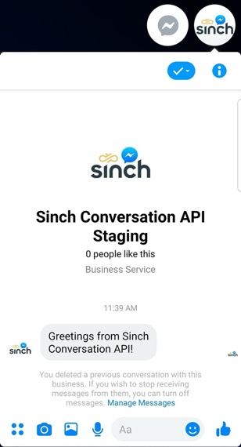
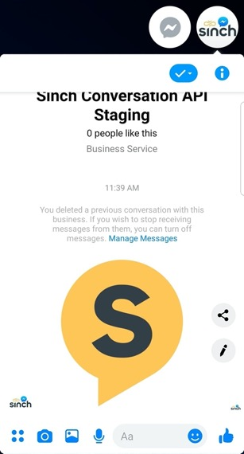
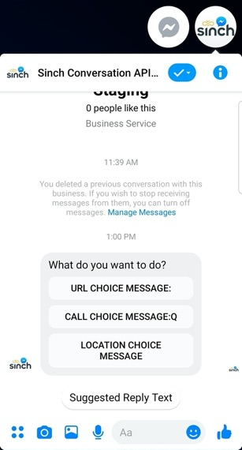
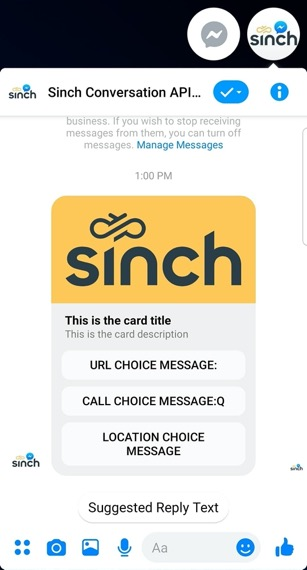
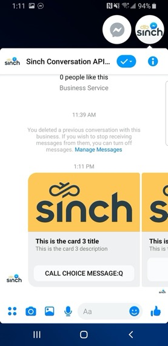
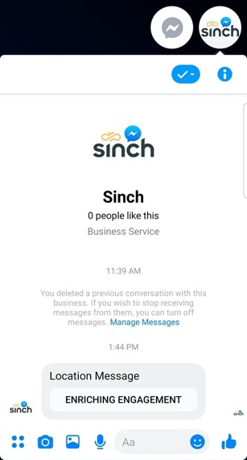

# Facebook Messenger

Sinch Conversation API Facebook Messenger specific configurations and message transcoding.

## Conversation API Facebook Messenger Support

Conversation API supports Facebook Messenger and allows sending messages from Facebook Pages. The page can't initiate the conversation; it must be started by a contact. To create and configure a Facebook Page and connect it to Conversation API **app**, follow the instructions below:

- Go to <https://developers.facebook.com/> and log in with your personal/developer account.

- Click on **My Apps** in the top right corner and select Pages App and click **Create App**.

- Fill in the display name for your app and contact Email, then click the **Create App** button.

- Once the app is created, you will see a dashboard with various products that you may add to your app. Click **Set Up** button inside a box with **Messenger** title.

- Scroll down to the **Access Tokens** section, and click the **Create New Page** button.

- Provide a page name and category, then click the **Create Page** button.

- Go back to the **Messenger Setup** page. Now click **Add or Remove pages** in the **Access Tokens** section. Select the previously created page and link it to your app (just **Next**, **Done**, **Ok**).

- You should now see a table row in a table in the **Access Tokens** modal. Click on **Generate Token** for that row. Copy this token (from now on referred as **FACEBOOK_PAGE_TOKEN**) and save it somewhere safe. This is the access token that you need to specify when setting up a Conversation API **app**.

- Then you need to configure a Messenger integration for your Conversation API **app**. The easiest way to do that's to use [Sinch Portal](https://dashboard.sinch.com/convapi/overview). Just select your **app** and click on "SET UP CHANNEL" beside the Messenger channel. Alternatively you can use the management API and specify the `channel_credentials` for Facebook Messenger when creating or updating your app. Example channel configuration is given in the snippet below:

```json
{
  "channel_credentials": [
    {
      "channel": "MESSENGER",
      "static_token": {
        "token": "{{FACEBOOK_PAGE_TOKEN}}"
      }
    }
  ],
  "display_name": "App name"
}
```

:::info Note

For Facebook Messenger you can configure Callback Validation between Facebook Messenger and Conversation API so that we can make sure, that the callbacks are valid.

This can be done via the portal when configuring your Facebook Messenger channel, or by adding `"callback_secret": "<string>"` to the `"channel_credentials"` object in the snippet above.

The secret for this validation in the case of Facebook Messenger is you App Secret from you Facebook Page.

:::

- Once you have created Conversation API App, go back to Facebook **Messenger Setup** page, find **Webhooks** section (just below **Access Tokens**), click **Add Callback URL** button and fill in with the following data (**remember to put region (eu1 or us1) and your Conversation App ID in the callback url**):

  Callback URL: `https://messenger-adapter.{{REGION}}.conversation-api.prod.sinch.com/adapter/v1/{{CONVERSATION_APP_ID}}/callback`

  Verify Token: `5651d9fd-5c33-4d7a-aa37-5e3e151c2a92`

- After clicking **Verify and Save**, if no errors occurred, a table in **Webhooks** section will appear, with your **Facebook Page** listed within. Click **Add Subscriptions** button, check all boxes and click **save**.

- Now you need to enable **pages_messaging** for your App. Scroll down to the **App review for Messenger** section and click **Add to submission** on the **pages_messaging** row.

- Scroll down further and you should see a **Current Submissions** section. You will most likely see a little **Additional Information Required** alert notifying you that you need to complete some details before submitting

- Follow the instructions and go to the settings to add the required pieces, which should be:

  - App Icon
  - Privacy Policy URL (for test and development purposes you may use a generator for it)
  - Category
  - Business Use

- This is enough for test and development purposes, you don't have to fill **Details** section nor submit it for review. Now you can send messages anyone that has been granted either the Administrator, Developer or Tester role for your app.

- Add webhook to your Conversation API **app** using [Sinch Portal](https://dashboard.sinch.com/convapi/overview) or the management API. Example snippet for creating webhook programmatically:

```json
{
  "app_id": "{{APP}}",
  "target": "{{WEBHOOK_URL}}",
  "target_type": "HTTP",
  "triggers": [
    "MESSAGE_DELIVERY",
    "EVENT_DELIVERY",
    "MESSAGE_INBOUND",
    "EVENT_INBOUND",
    "CONVERSATION_START",
    "CONVERSATION_STOP",
    "UNSUPPORTED"
  ]
}
```

- And finally, visit your Facebook Page as a user with proper role granted (preferably the one who created the page) and try sending a message to it - remember that a user has to start the conversation. If everything works fine, you should receive two callbacks, one with `conversation_start_notification`:

```json
{
  "app_id": "01E9DQJFPWGZ2T05XTVZAD0BYB",
  "conversation_start_notification": {
    "conversation": {
      "id": "01E9DV2N8C6CK41XFPGQPN0NWE",
      "app_id": "01E9DQJFPWGZ2T05XTVZAD0BYB",
      "contact_id": "01E9DV2N7TYPJ50V0FYC08110D",
      "last_received": "2020-05-28T14:30:48Z",
      "active_channel": "CHANNEL_UNSPECIFIED",
      "active": true,
      "metadata": "",
      "active_channel_senders": []
    }
  }
}
```

- and one with the message you've just sent:

```json
{
  "app_id": "01E9DQJFPWGZ2T05XTVZAD0BYB",
  "accepted_time": "2020-05-28T14:30:47.850538Z",
  "message": {
    "id": "01E9DV2N92BMDD034JZ0AQ0VKB",
    "direction": "TO_APP",
    "contact_message": {
      "text_message": {
        "text": "Hello World"
      }
    },
    "channel": "MESSENGER",
    "conversation_id": "01E9DV2N8C6CK41XFPGQPN0NWE",
    "contact_id": "01E9DV2N7TYPJ50V0FYC08110D",
    "metadata": "",
    "accept_time": "2020-05-28T14:30:47.841429Z"
  }
}
```

- Now, with a conversation created automatically, you can use received **contact_id** to send a response for this user:

```json
{
  "app_id": "{{APP_ID}}",
  "recipient": {
    "contact_id": "{{CONTACT_ID}}"
  },
  "message": {
    "text_message": {
      "text": "Text message from Sinch Conversation API."
    }
  },
  "channel_priority_order": ["MESSENGER"]
}
```

- You should receive callbacks with information that message has been delivered and read. The channel is now configured.

:::warning Warning (from 16th December)

Regarding the changes introduced by Facebook Messenger to comply with new privacy rules in Europe, delivered and read callbacks won't be shipped.

This condition impacts you if:

- Your app points to messenger bot which is created for a European page.
- Your app points to messenger bot which is created for a page that has European admins.
- You send a message to customers in Europe.

Restrictions will be revised by Facebook Messenger in the future.

:::

### Rich Message Support

This section provides detailed information about which rich messages are natively supported by Facebook Messenger channel and what transcoding is applied in other cases.

#### Sending Messages

Here we give a mapping between Conversation API generic message format and the Messenger rendering on mobile devices.

Please note that for the sake of brevity the JSON snippets don't include the **recipient** and **app_id** which are both required when sending a message.

If you want to send messages outside the standard 24h response window you can do that by adding Messenger channel specific properties in your message request.

For more info check out [**Channel Specific Properties**](/docs/conversation/channel-support/properties.md).

##### Text Messages

---

Conversation API POST `messages:send`

```json
{
  "message": {
    "text_message": {
      "text": "Greetings from Sinch Conversation API."
    }
  }
}
```

The rendered message:



###### Media Messages

---

Conversation API POST `messages:send`

```json
{
  "message": {
    "media_message": {
      "url": "https://1vxc0v12qhrm1e72gq1mmxkf-wpengine.netdna-ssl.com/wp-content/uploads/2018/12/favicon.png"
    }
  }
}
```

The rendered message:



:::warning Warning (from 16th December 2020)

Regarding the changes introduced by Facebook Messenger to comply with new privacy rules in Europe, “Media Message” will only be rendered if it contains image file, for any other type of file (audio, video) an error will be returned, and no message will be sent.

This condition impacts you if:

- Your app points to messenger bot which is created for a European page.
- Your app points to messenger bot which is created for a page that has European admins.
- You send a message to customers in Europe.

Until Facebook Messenger restores this feature, you can send a message as a “Text Message” with plain text URL which points to audio/video file.

:::

###### Choice Messages

---

Conversation API POST `messages:send`

```json
{
  "message": {
    "choice_message": {
      "text_message": {
        "text": "What do you want to do?"
      },
      "choices": [
        {
          "text_message": {
            "text": "Suggested Reply"
          }
        },
        {
          "url_message": {
            "title": "URL Choice Message:",
            "url": "https://www.sinch.com"
          }
        }
        {
          "location_message": {
            "title": "Location Choice Message",
            "label": "Enriching Engagement",
            "coordinates": {
              "latitude": 55.610479,
              "longitude": 13.002873
            }
          }
        }
      ]
    }
  }
}
```

The rendered message:



:::warning Warning (from 16th December 2020)

Regarding the changes introduced by Facebook Messenger to comply with new privacy rules in Europe, `Choice Message` will only be supported on Android and iOS messenger’s apps. Message won't be rendered on web client and chat plugin, instead of that Users will see an Attachment unavailable error message.

This condition impacts you if:

- Your app points to messenger bot which is created for a European page.
- Your app points to messenger bot which is created for a page that has European admins.
- You send a message to customers in Europe.

Restrictions will be revised by Facebook Messenger in the future.

:::

###### Card Messages

---

Conversation API POST `messages:send`

```json
{
  "message": {
    "card_message": {
      "title": "This is the card title",
      "description": "This is the card description",
      "media_message": {
        "url": "https://1vxc0v12qhrm1e72gq1mmxkf-wpengine.netdna-ssl.com/wp-content/uploads/2019/05/Sinch-logo-Events.png"
      },
      "choices": [
        {
          "text_message": {
            "text": "Suggested Reply Text"
          }
        },
        {
          "call_message": {
            "title": "Someone",
            "phone_number": "46732000000"
          }
        },
        {
          "url_message": {
            "title": "Sinch",
            "url": "https://www.sinch.com"
          }
        }
      ]
    }
  }
}
```

The rendered message:



:::warning Warning (from 16th December 2020)

Regarding the changes introduced by Facebook Messenger to comply with new privacy rules in Europe, `Card Message` will only be supported on Android and iOS messenger’s apps. Message won't be rendered on web client and chat plugin, instead of that Users will see an Attachment unavailable error message.

This condition impacts you if:

- Your app points to messenger bot which is created for a European page.
- Your app points to messenger bot which is created for a page that has European admins.
- You send a message to customers in Europe.

Restrictions will be revised by Facebook Messenger in the future.

:::

###### Carousel Messages

---

Conversation API POST `messages:send`

```json
{
  "message": {
    "carousel_message": {
      "cards": [
        {
          "title": "This is the card 1 title",
          "description": "This is the card 1 description",
          "media_message": {
            "url": "https://1vxc0v12qhrm1e72gq1mmxkf-wpengine.netdna-ssl.com/wp-content/uploads/2019/05/Sinch-logo-Events.png"
          },
          "choices": [
            {
              "text_message": {
                "text": "Suggested Reply 1 Text"
              }
            },
            {
              "text_message": {
                "text": "Suggested Reply 2 Text"
              }
            },
            {
              "text_message": {
                "text": "Suggested Reply 3 Text"
              }
            }
          ]
        },
        {
          "title": "This is the card 2 title",
          "description": "This is the card 2 description",
          "media_message": {
            "url": "https://1vxc0v12qhrm1e72gq1mmxkf-wpengine.netdna-ssl.com/wp-content/uploads/2019/05/Sinch-logo-Events.png"
          },
          "choices": [
            {
              "url_message": {
                "title": "URL Choice Message:",
                "url": "https://www.sinch.com"
              }
            }
          ]
        },
        {
          "title": "This is the card 3 title",
          "description": "This is the card 3 description",
          "media_message": {
            "url": "https://1vxc0v12qhrm1e72gq1mmxkf-wpengine.netdna-ssl.com/wp-content/uploads/2019/05/Sinch-logo-Events.png"
          },
          "choices": [
            {
              "call_message": {
                "title": "Call Choice Message:Q",
                "phone_number": "46732000000"
              }
            }
          ]
        },
        {
          "title": "This is the card 4 title",
          "description": "This is the card 4 description",
          "media_message": {
            "url": "https://1vxc0v12qhrm1e72gq1mmxkf-wpengine.netdna-ssl.com/wp-content/uploads/2019/05/Sinch-logo-Events.png"
          },
          "choices": [
            {
              "location_message": {
                "title": "Location Choice Message",
                "label": "Enriching Engagement",
                "coordinates": {
                  "latitude": 55.610479,
                  "longitude": 13.002873
                }
              }
            }
          ]
        }
      ]
    }
  }
}
```

The rendered message:



:::warning Warning (from 16th December 2020)

Regarding the changes introduced by Facebook Messenger to comply with new privacy rules in Europe, `Carousel Message` will only be supported on Android and iOS messenger’s apps. Message won't be rendered on web client and chat plugin, instead of that Users will see an Attachment unavailable error message.

This condition impacts you if:

- Your app points to messenger bot which is created for a European page.
- Your app points to messenger bot which is created for a page that has European admins.
- You send a message to customers in Europe.

Restrictions will be revised by Facebook Messenger in the future.

:::

###### Location Messages

---

Conversation API POST `messages:send`

```json
{
  "message": {
    "location_message": {
      "title": "Location Message",
      "label": "Enriching Engagement",
      "coordinates": {
        "latitude": 55.610479,
        "longitude": 13.002873
      }
    }
  }
}
```

The rendered message:



:::warning Warning (from 16th December 2020)

Regarding the changes introduced by Facebook Messenger to comply with new privacy rules in Europe, `Location Message` will only be supported on Android and iOS messenger’s apps. Message won't be rendered on web client and chat plugin, instead of that Users will see an Attachment unavailable error message.

This condition impacts you if:

- Your app points to messenger bot which is created for a European page.
- Your app points to messenger bot which is created for a page that has European admins.
- You send a message to customers in Europe.

Restrictions will be revised by Facebook Messenger in the future.

:::

##### Receiving Messages

Facebook Messenger channel supports various kinds of contact messages - text, media, media card, location and quick replies.
All of these are delivered by Conversation API with POST to `MESSAGE_INBOUND` webhook:

---

Example text reply:

```json
{
  "app_id": "01EB37HMH1M6SV18ASNS3G135H",
  "accepted_time": "2020-10-01T12:06:13.806686Z",
  "event_time": "2020-10-01T12:06:13.254Z",
  "project_id": "c36f3d3d-1513-4edd-ae42-11995557ff61",
  "message": {
    "id": "01EKJ0WGFM7TR314K4D9Y31J5S",
    "direction": "TO_APP",
    "contact_message": {
      "text_message": {
        "text": "This is text message from a Messenger user."
      }
    },
    "channel_identity": {
      "channel": "MESSENGER",
      "identity": "534183549153491",
      "app_id": "01EB37HMH1M6SV18ASNS3G135H"
    },
    "conversation_id": "01EKJ0KSWXMVDF05MG9TQ20S06",
    "contact_id": "01EKA07N79THJ20WSN6AS30TMW",
    "metadata": "",
    "accept_time": "2020-10-01T12:06:13.794339Z"
  }
}
```

---

Example location contact message:

```json
{
  "app_id": "01EB37HMH1M6SV18ASNS3G135H",
  "accepted_time": "2020-10-01T12:07:35.513615Z",
  "event_time": "2020-10-01T12:07:34.935Z",
  "project_id": "c36f3d3d-1513-4edd-ae42-11995557ff61",
  "message": {
    "id": "01EKJ0Z07XKM6H04VB5Q941QBP",
    "direction": "TO_APP",
    "contact_message": {
      "location_message": {
        "title": "",
        "coordinates": {
          "latitude": 55.73064,
          "longitude": 13.160131
        },
        "label": ""
      }
    },
    "channel_identity": {
      "channel": "MESSENGER",
      "identity": "534183549153491",
      "app_id": "01EB37HMH1M6SV18ASNS3G135H"
    },
    "conversation_id": "01EKJ0KSWXMVDF05MG9TQ20S06",
    "contact_id": "01EKA07N79THJ20WSN6AS30TMW",
    "metadata": "",
    "accept_time": "2020-10-01T12:07:35.496355Z"
  }
}
```

---

Example media message:

```json
{
  "app_id": "01EB37HMH1M6SV18ASNS3G135H",
  "accepted_time": "2020-10-01T12:10:55.073703Z",
  "event_time": "2020-10-01T12:10:53.991Z",
  "project_id": "c36f3d3d-1513-4edd-ae42-11995557ff61",
  "message": {
    "id": "01EKJ1534NWK5R02TGWEJN13HA",
    "direction": "TO_APP",
    "contact_message": {
      "media_message": {
        "url": "https://scontent.xx.fbcdn.net/v/t1.15752-9/174244980_1170704636714502_2133968827805507208_n.jpg"
      }
    },
    "channel_identity": {
      "channel": "MESSENGER",
      "identity": "534183549153491",
      "app_id": "01EB37HMH1M6SV18ASNS3G135H"
    },
    "conversation_id": "01EKJ0KSWXMVDF05MG9TQ20S06",
    "contact_id": "01EKA07N79THJ20WSN6AS30TMW",
    "metadata": "",
    "accept_time": "2020-10-01T12:10:55.060170Z"
  }
}
```

---

Example media card message:

```json
{
  "app_id": "01EB37HMH1M6SV18ASNS3G135H",
  "accepted_time": "2020-10-01T12:10:55.073703Z",
  "event_time": "2020-10-01T12:10:53.991Z",
  "project_id": "c36f3d3d-1513-4edd-ae42-11995557ff61",
  "message": {
    "id": "01EKJ1534NWK5R02TGWEJN13HA",
    "direction": "TO_APP",
    "contact_message": {
      "media_card_message": {
        "url": "https://scontent.xx.fbcdn.net/v/t1.15752-9/174244980_1170704636714502_2133968827805507208_n.jpg",
        "caption": "caption text"
      }
    },
    "channel_identity": {
      "channel": "MESSENGER",
      "identity": "534183549153491",
      "app_id": "01EB37HMH1M6SV18ASNS3G135H"
    },
    "conversation_id": "01EKJ0KSWXMVDF05MG9TQ20S06",
    "contact_id": "01EKA07N79THJ20WSN6AS30TMW",
    "metadata": "",
    "accept_time": "2020-10-01T12:10:55.060170Z"
  }
}
```

---

Example quick reply message:

```json
{
  "app_id": "01EGQYR8N9S5VF096DQKYF08JD",
  "accepted_time": "2020-10-01T12:39:48.469849Z",
  "event_time": "2020-10-01T12:39:48.296Z",
  "project_id": "ab5536b1-31b0-45e8-aec6-b35f13c41d0b",
  "message": {
    "id": "01EKJ2SZX9N6F11SJ11G511H6J",
    "direction": "TO_APP",
    "contact_message": {
      "choice_response_message": {
        "message_id": "01EKJ2SWHGDMYA0F0F1PQJ09WQ",
        "postback_data": "suggested reply postback"
      }
    },
    "channel_identity": {
      "channel": "MESSENGER",
      "identity": "534183549153491",
      "app_id": "01EGQYR8N9S5VF096DQKYF08JD"
    },
    "conversation_id": "01EHY7KA6ZC03C1Q5QTRZ60GDA",
    "contact_id": "01EHY7KA2BYT8A11E6Y2271NHA",
    "metadata": "",
    "accept_time": "2020-10-01T12:39:48.457764Z"
  }
}
```

##### Receiving Delivery Receipts

Messages sent on Messenger channel can have three statuses: DELIVERED, READ and FAILED.
If the status is FAILED the reason will include more information about the failure.
Below is an example for DELIVERED receipt - READ and FAILED differ by the
`status` and `reason` only.
Conversation API POST to `MESSAGE_DELIVERY` webhook:

```json
{
  "app_id": "01EB37HMH1M6SV18ASNS3G135H",
  "accepted_time": "2020-10-01T12:10:00.530Z",
  "event_time": "2020-10-01T12:10:03.624Z",
  "project_id": "c36f3d3d-1513-4edd-ae42-11995557ff61",
  "message_delivery_report": {
    "message_id": "01EKJ13DYJX54C0N062N0Q1J9F",
    "conversation_id": "01EKJ0KSWXMVDF05MG9TQ20S06",
    "status": "READ",
    "channel_identity": {
      "channel": "MESSENGER",
      "identity": "534183549153491",
      "app_id": "01EB37HMH1M6SV18ASNS3G135H"
    },
    "contact_id": "01EKA07N79THJ20WSN6AS30TMW",
    "metadata": ""
  }
}
```

> 🚧 Warning (from 16th December 2020)
>
> Regarding the changes introduced by Facebook Messenger to comply with new privacy rules in Europe, Messenger does NOT send Delivery Reports - i.e. you will not get READ or DELIVERED statuses from Conversation API on this channel.
>
> This condition impacts you if:
>
> - Your app points to a Messenger bot which is created for a European page.
> - Your app points to a Messenger bot which is created for a page that has European admins.
> - You send a message to customers in Europe.
>
> Restrictions will be revised by Facebook Messenger in the future and this feature will be restored.
