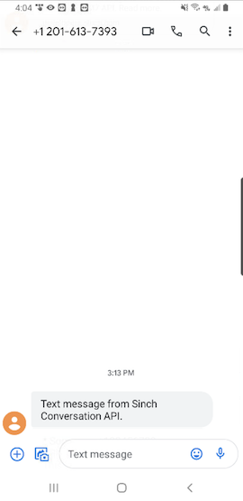
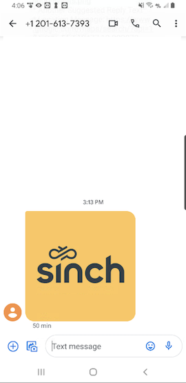
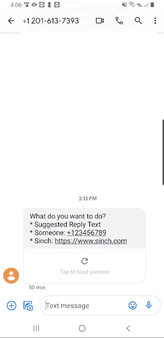
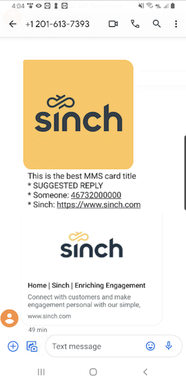
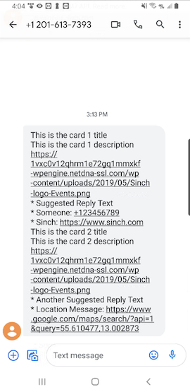
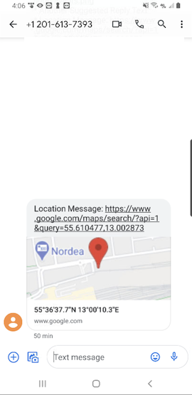

### Conversation API MMS Support <span class="betabadge">Beta</span>

MMS support in Conversation API is integrated via the Sinch MMS MM7 API: [MM7 API](https://developers.sinch.com/docs/mm7-service)

To be able to use the MMS channel in Conversation API, you need to have an MMS Account at Sinch. More information in the [MMS documentation](https://developers.sinch.com/docs/mms-introduction).

#### Channel Configuration

You need a Sinch MMS Account in order to integrate with MMS channel. Your account manager can help you with the creation and configuration of MMS for your Conversation API **app**. You can request this through the [Sinch Portal](https://dashboard.sinch.com/convapi/overview). Just select your **app** and click on "SET UP CHANNEL" beside the MMS channel.

You will receive four pieces of credentials which you can then use in the [Sinch Portal](https://dashboard.sinch.com/convapi/overview) to finish the MMS integration for your Conversation API **app**. These credentials are:

- MMS Account ID
- MMS API Key
- Basic Authentication Username
- Basic Authentication Password

Alternatively, you can use the management API to configure your **app** with `channel_credentials` for the MMS channel. The example snippet below shows the credentials configuration for the MMS channel:

```json
{
  "channel_credentials": [
    {
      "channel": "MMS",
      "mms_credentials": {
        "account_id": "{{MMS_ACCOUNT_ID}}",
        "api_key": "{{MMS_API_KEY}}",
        "basic_auth": {
          "username": "{{BASIC_AUTH_USERNAME}}",
          "password": "{{BASIC_AUTH_PASSWORD}}"
        }
      }
    }
  ]
}
```

You need to replace:

- `{{MMS_ACCOUNT_ID}}` with your MMS Account ID
- `{{MMS_API_KEY}}` with your MMS API Key
- `{{BASIC_AUTH_USERNAME}}` with your Basic Authentication username for the MMS API
- `{{BASIC_AUTH_PASSWORD}}` with your Basic Authentication password for the MMS API

Don't forget to create at least one Conversation API webhook which will trigger POST callbacks to the given URL. You can do that from the [Sinch Portal](https://dashboard.sinch.com/convapi/overview) or programmatically using the management API.

#### Rich Message Support

This section provides detailed information about which rich messages are natively supported by MMS channel and what transcoding is applied in other cases.

##### Sending Messages

Here we give a mapping between Conversation API generic message format and the MMS rendering on mobile devices.

When sending a message on MMS channel you're expected to specify a sender - a shortcode or longnumber. This information should be passed in each message request under `channel_properties` -> `MMS_SENDER. See a full request example below.

Conversation API POST `messages:send`

```json
{
  "app_id": "{{APP_ID}}",
  "recipient": {
    "contact_id": "{{CONTACT_ID}}"
  },
  "message": {
    "text_message": {
      "text": "Text message from Sinch Conversation API."
    }
  },
  "channel_priority_order": ["MMS"],
  "channel_properties": {
    "MMS_SENDER": "{{YOUR_MMS_SENDER}}"
  }
}
```

You need to replace `{{YOUR_MMS_SENDER}}` with your shortcode or longnumber.

Please note that for the sake of brevity the JSON snippets don't include the **recipient** and **app_id** which are both required when sending a message.

###### Text Messages

Text messages are natively supported by MMS channel.

---

Conversation API POST `messages:send`

```json
{
  "message": {
    "text_message": {
      "text": "Text message from Sinch Conversation API."
    }
  }
}
```

The rendered message:



###### Media Messages

MMS supports media messages natively. The content of the media message will be validated when sending messages, and checked against the recommendations for MMS messages listed in the [MMS documentation](https://developers.sinch.com/docs/mms-bestpractices)

---

Conversation API POST `messages:send`

```json
{
  "message": {
    "media_message": {
      "url": "https://1vxc0v12qhrm1e72gq1mmxkf-wpengine.netdna-ssl.com/wp-content/uploads/2019/05/Sinch-logo-Events.png"
    }
  }
}
```

The rendered message:



###### Choice Messages

MMS doesn't support natively Choice messages therefore they're transcoded and sent as text message by Conversation API.

---

Conversation API POST `messages:send`

```json
{
  "message": {
    "choice_message": {
      "text_message": {
        "text": "What do you want to do?"
      },
      "choices": [
        {
          "text_message": {
            "text": "Suggested Reply Text"
          }
        },
        {
          "call_message": {
            "title": "Someone",
            "phone_number": "+123456789"
          }
        },
        {
          "url_message": {
            "title": "Sinch",
            "url": "https://www.sinch.com"
          }
        }
      ]
    }
  }
}
```

The rendered message:



###### Card Messages

MMS supports natively Card messages.

---

Conversation API POST `messages:send`

```json
{
  "message": {
    "card_message": {
      "title": "This is the best MMS card title",
      "media_message": {
        "url": "https://1vxc0v12qhrm1e72gq1mmxkf-wpengine.netdna-ssl.com/wp-content/uploads/2019/05/Sinch-logo-Events.png"
      },
      "choices": [
        {
          "text_message": {
            "text": "Suggested Reply"
          }
        },
        {
          "call_message": {
            "title": "Someone",
            "phone_number": "+46732000000"
          }
        },
        {
          "url_message": {
            "title": "Sinch",
            "url": "https://www.sinch.com"
          }
        }
      ]
    }
  }
}
```

The rendered message:



###### Carousel Messages

MMS doesn't support natively Carousel messages therefore they're transcoded and sent as text message by Conversation API.

---

Conversation API POST `messages:send`

```json
{
  "message": {
    "carousel_message": {
      "cards": [
        {
          "title": "This is the card 1 title",
          "description": "This is the card 1 description",
          "media_message": {
            "url": "https://1vxc0v12qhrm1e72gq1mmxkf-wpengine.netdna-ssl.com/wp-content/uploads/2019/05/Sinch-logo-Events.png"
          },
          "choices": [
            {
              "text_message": {
                "text": "Suggested Reply Text"
              }
            },
            {
              "call_message": {
                "title": "Someone",
                "phone_number": "+46732000000"
              }
            },
            {
              "url_message": {
                "title": "Sinch",
                "url": "https://www.sinch.com"
              }
            }
          ]
        },
        {
          "title": "This is the card 2 title",
          "description": "This is the card 2 description",
          "media_message": {
            "url": "https://1vxc0v12qhrm1e72gq1mmxkf-wpengine.netdna-ssl.com/wp-content/uploads/2019/05/Sinch-logo-Events.png"
          },
          "choices": [
            {
              "text_message": {
                "text": "Another Suggested Reply Text"
              }
            },
            {
              "location_message": {
                "title": "Location Message",
                "label": "Enriching Engagement",
                "coordinates": {
                  "latitude": 55.610479,
                  "longitude": 13.002873
                }
              }
            }
          ]
        }
      ]
    }
  }
}
```

The rendered message:



###### Location Messages

MMS doesn't support natively Location messages, and so they're transcoded and sent as text message by Conversation API.

---

Conversation API POST `messages:send`

```json
{
  "message": {
    "location_message": {
      "title": "Location Message",
      "label": "Enriching Engagement",
      "coordinates": {
        "latitude": 55.610479,
        "longitude": 13.002873
      }
    }
  }
}
```

The rendered message:



##### Receiving Messages

Messages sent by your contacts will only arrive on MMS channel if they were recognized as MMS on the sender device. This means a contact messages that:

- contain media attachment only
- contain both media attachment and plain text
- any message that uses the MMS "Subject" field

This implies that a plain text contact message will be seen as SMS by the device, therefore it won't be routed as an MMS, and it won't reach your Conversation API App on MMS channel. However, you can use the sender that you have provisioned for MMS to be configured for your Sinch SMS service plan as well. In a setup like that the following scenario is possible:

1. You have an SMS and an MMS account at Sinch, having the same sender shortcode/longnumber configured for them
2. You have a Conversation API app configured with MMS and SMS channels with the above mentioned accounts
3. You send a message to your contact using your Conversation API App on MMS channel
4. Your contact responds with plain text SMS
5. You get the `MESSAGE_INBOUND` webhook for the contact message on SMS channel even though you initiated the conversation on MMS

##### Supported contact messages

MMS supports contact initiated messages like Text, Media, MediaCard, and Choice Responses.

If the contact message had media attachments the media content is hosted by Sinch and you get a publicly accessible URL pointing to it.

Conversation API POST to `MESSAGE_INBOUND` webhook for text message:

```json
{
  "app_id": "01E3S8B6YCMRNR0GGM94H80ACX",
  "accepted_time": "2020-04-24T08:02:50.184581Z",
  "message": {
    "id": "01E6NKBV63YG6K01ENEW7S1N80",
    "direction": "TO_APP",
    "contact_message": {
      "text_message": {
        "text": "Hi from contact"
      }
    },
    "channel": "MMS",
    "conversation_id": "01E6K4A8PGZ6MV0GD3C7M901MZ",
    "contact_id": "01E6K4A8N3NANZ05VM0FS80EHD",
    "metadata": "",
    "accept_time": "2020-04-24T08:02:50.179021Z"
  }
}
```

Conversation API POST to `MESSAGE_INBOUND` webhook for media message:

```json
{
  "app_id": "01E3S8B6YCMRNR0GGM94H80ACX",
  "accepted_time": "2020-04-24T08:02:50.184581Z",
  "message": {
    "id": "01E6NKBV63YG6K01ENEW7S1N80",
    "direction": "TO_APP",
    "contact_message": {
      "media_message": {
        "url": "https://convapi-eu1tst.s3.eu-west-1.amazonaws.com/01EPRZJ0HXTDEH1BTYJT4417GE/01F2K124T4513Q0CCHQ5SN0DH6.png"
      }
    },
    "channel": "MMS",
    "conversation_id": "01E6K4A8PGZ6MV0GD3C7M901MZ",
    "contact_id": "01E6K4A8N3NANZ05VM0FS80EHD",
    "metadata": "",
    "accept_time": "2020-04-24T08:02:50.179021Z"
  }
}
```

Conversation API POST to `MESSAGE_INBOUND` webhook for media card message:

```json
{
  "app_id": "01E3S8B6YCMRNR0GGM94H80ACX",
  "accepted_time": "2020-04-24T08:02:50.184581Z",
  "message": {
    "id": "01E6NKBV63YG6K01ENEW7S1N80",
    "direction": "TO_APP",
    "contact_message": {
      "media_card_message": {
        "url": "https://convapi-eu1tst.s3.eu-west-1.amazonaws.com/01EPRZJ0HXTDEH1BTYJT4417GE/01F2K124T4513Q0CCHQ5SN0DH6.png",
        "caption": "caption text"
      }
    },
    "channel": "MMS",
    "conversation_id": "01E6K4A8PGZ6MV0GD3C7M901MZ",
    "contact_id": "01E6K4A8N3NANZ05VM0FS80EHD",
    "metadata": "",
    "accept_time": "2020-04-24T08:02:50.179021Z"
  }
}
```

Conversation API POST to `MESSAGE_INBOUND` webhook for choice response message:

```json
{
  "app_id": "01E3S8B6YCMRNR0GGM94H80ACX",
  "accepted_time": "2020-04-24T08:02:50.184581Z",
  "message": {
    "id": "01E6NKBV63YG6K01ENEW7S1N80",
    "direction": "TO_APP",
    "contact_message": {
      "choice_response_message": {
        "message_id": "01EKJ2SWHGDMYA0F0F1PQJ09WQ",
        "postback_data": "postback"
      }
    },
    "channel": "MMS",
    "conversation_id": "01E6K4A8PGZ6MV0GD3C7M901MZ",
    "contact_id": "01E6K4A8N3NANZ05VM0FS80EHD",
    "metadata": "",
    "accept_time": "2020-04-24T08:02:50.179021Z"
  }
}
```

##### Receiving Delivery Receipts

Messages sent on MMS channel have two statuses: DELIVERED, and FAILED. READ status is not supported on the channel.

Below is an example for DELIVERED receipt - FAILED differs by the `status` and `reason` only.

Conversation API POST to `MESSAGE_DELIVERY` webhook:

```json
{
  "app_id": "01E3S8B6YCMRNR0GGM94H80ACX",
  "accepted_time": "2020-04-23T09:55:04.766Z",
  "message_delivery_report": {
    "message_id": "01E6K7CMXY3KHH0AGCTY6D04F2",
    "conversation_id": "01E6JY5HMCADX31SANQ0YE0CH6",
    "status": "DELIVERED",
    "channel": "MMS",
    "reason": "",
    "metadata": ""
  }
}
```
