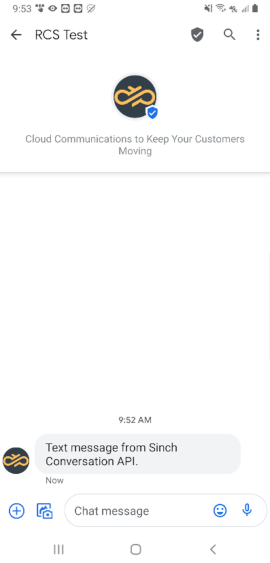
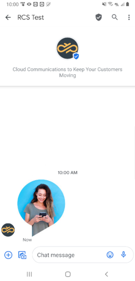
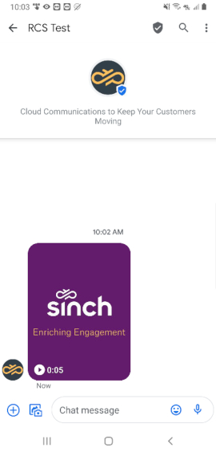
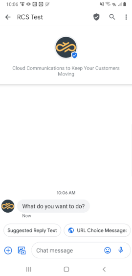
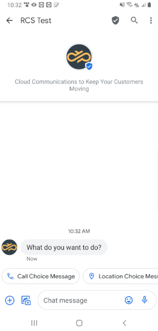
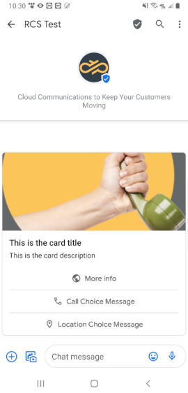
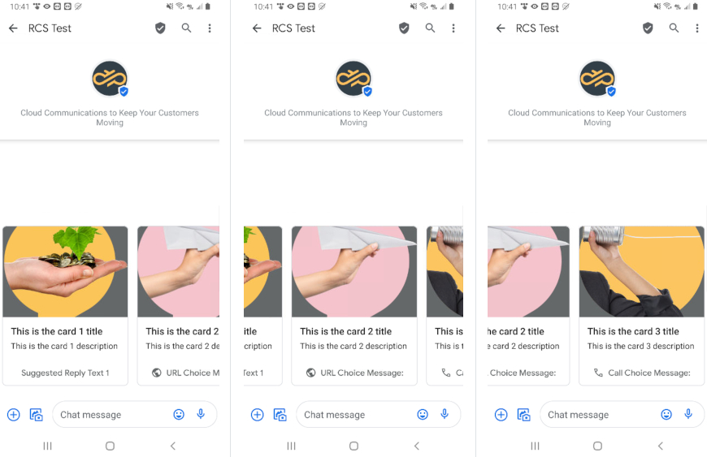
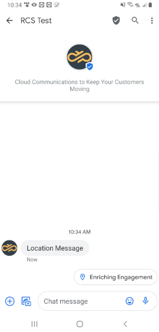

# RCS

Sinch Conversation API RCS specific configurations and message transcoding.

## Conversation API RCS Support

Conversation API provides support for RCS channel through Sinch RCS API.
To start using RCS through Conversation API you need to first have a Sinch RCS bot -
[read more](https://developers.sinch.com/docs/rcs-introduction).

### Channel Configuration

#### Sending Config

Sending a RCS message requires a Conversation API **app** with
`channel_credentials` for RCS channel (You can create an **app** either in the
portal or through API call - [read more](https://developers.sinch.com/reference/#app_createapp)). Example, **app** is given in the following snippet:

```json
{
  "channel_credentials": [
    {
      "channel": "RCS",
      "static_bearer": {
        "claimed_identity": "{{RCS_BOT_ID}}",
        "token": "{{RCS_BEARER_TOKEN}}"
      }
    }
  ]
}
```

You need to replace:

- `{{RCS_BOT_ID}}` with your Sinch RCS bot ID
- `{{RCS_BEARER_TOKEN}}` with the bot's access token.

##### Receiving Config

Receiving contact messages (replies) and delivery receipts
from RCS requires setting the Callback URL of the RCS bot to
point to your Conversation API **app**. The URL is the following:

```html
https://rcs-adapter.{{REGION}}.conversation-api.int.prod.sinch.com/adapter/v1/{{CONV_API_APP_ID}}/callback
```

Where:

- `{{REGION}}` is one of `eu1` or `us1` and must match the region of your app.
- `{{CONV_API_APP_ID}}` is your **app** id.

You also need to configure at least one Conversation API webhook which
will trigger POST callbacks to the given URL (You can create a **webhook**
either in the portal or through API call - [read more](https://developers.sinch.com/reference/#webhooks_createwebhook)).

#### Rich Message Support

This section provides detailed information about which rich messages are
natively supported by RCS channel and what transcoding is applied in
other cases.

##### Sending Messages

Here we give a mapping between Conversation API generic message format
and the RCS rendering on mobile devices.
Please note that for the sake of brevity the JSON snippets don't include
the **recipient** and **app_id** which are both required when sending a message.

###### Text Messages

RCS channel natively supports Text Messages.

---

Conversation API POST `messages:send`

```json
{
  "message": {
    "text_message": {
      "text": "Text message from Sinch Conversation API."
    }
  }
}
```

The rendered message:



###### Media Messages

RCS channel natively supports Media Messages. Sending media messages is easy - simply
specify the URL to the media and Conversation API will automatically detect what type of RCS
message to use - image or video.

---

Conversation API POST `messages:send` with **Image** media url

```json
{
  "message": {
    "media_message": {
      "url": "https://1vxc0v12qhrm1e72gq1mmxkf-wpengine.netdna-ssl.com/wp-content/uploads/2020/02/sinch-mobile-communication-platform-woman-x1.png"
    }
  }
}
```

The rendered message:



---

Conversation API POST `messages:send` with **Video** media url

```json
{
  "message": {
    "media_message": {
      "url": "https://clxlundrcs.s3.eu-central-1.amazonaws.com/conv-api-doc/sinch_video_example.mp4"
    }
  }
}
```

The rendered message:



###### Choice Messages

RCS channel provides native support for Choice Messages. As a user you can select from four choice types:

- Text Choice
- URL Choice
- Call Choice
- Location Choice

Below snippets presents all representations of above choice types. You can send maximum 3 choices in one message.

---

Conversation API POST `messages:send` with **Text Choice** and **URL Choice**

```json
{
  "message": {
    "choice_message": {
      "text_message": {
        "text": "What do you want to do?"
      },
      "choices": [
        {
          "text_message": {
            "text": "Suggested Reply Text"
          }
        },
        {
          "url_message": {
            "title": "URL Choice Message:",
            "url": "https://www.sinch.com"
          }
        }
      ]
    }
  }
}
```

The rendered message:



---

Conversation API POST `messages:send` with **Call Choice** and **Location Choice**

```json
{
  "message": {
    "choice_message": {
      "text_message": {
        "text": "What do you want to do?"
      },
      "choices": [
        {
          "call_message": {
            "title": "Call Choice Message",
            "phone_number": "46732000000"
          }
        },
        {
          "location_message": {
            "title": "Location Choice Message",
            "label": "Enriching Engagement",
            "coordinates": {
              "latitude": 55.610479,
              "longitude": 13.002873
            }
          }
        }
      ]
    }
  }
}
```

The rendered message:



###### Card Messages

RCS supports natively Card Messages with maximum 3 choices.
The media message in the Card should point to an image or a video.

---

Conversation API POST `messages:send`

```json
{
  "message": {
    "card_message": {
      "title": "This is the card title",
      "description": "This is the card description",
      "media_message": {
        "url": "https://1vxc0v12qhrm1e72gq1mmxkf-wpengine.netdna-ssl.com/wp-content/uploads/2019/01/18.png"
      },
      "choices": [
        {
          "url_message": {
            "title": "More info",
            "url": "https://www.sinch.com"
          }
        },
        {
          "call_message": {
            "title": "Call Choice Message",
            "phone_number": "46732000000"
          }
        },
        {
          "location_message": {
            "title": "Location Choice Message",
            "label": "Enriching Engagement",
            "coordinates": {
              "latitude": 55.610479,
              "longitude": 13.002873
            }
          }
        }
      ]
    }
  }
}
```

The rendered message:



###### Carousel Messages

RCS supports natively Carousel Messages. You can put from 1 to 10 cards in one message.
Each card can consist of the elements described in "Card Messages" section. If you send only one card,
the message will be render as a normal Card Message. Additionally, RCS channel supports maximum 3 outer choices. You can put outer choices into
the `carousel_message.choices` array field, and these choices will be rendered right after the displayed cards.

---

Conversation API POST `messages:send`

```json
{
  "message": {
    "carousel_message": {
      "cards": [
        {
          "title": "This is the card 1 title",
          "description": "This is the card 1 description",
          "media_message": {
            "url": "https://1vxc0v12qhrm1e72gq1mmxkf-wpengine.netdna-ssl.com/wp-content/uploads/2019/03/RevenueAssurance_bubble.png"
          },
          "choices": [
            {
              "text_message": {
                "text": "Suggested Reply Text 1"
              }
            }
          ]
        },
        {
          "title": "This is the card 2 title",
          "description": "This is the card 2 description",
          "media_message": {
            "url": "https://1vxc0v12qhrm1e72gq1mmxkf-wpengine.netdna-ssl.com/wp-content/uploads/2019/01/05.png"
          },
          "choices": [
            {
              "url_message": {
                "title": "URL Choice Message:",
                "url": "https://www.sinch.com"
              }
            }
          ]
        },
        {
          "title": "This is the card 3 title",
          "description": "This is the card 3 description",
          "media_message": {
            "url": "https://1vxc0v12qhrm1e72gq1mmxkf-wpengine.netdna-ssl.com/wp-content/uploads/2020/07/Sinch-Voice-calling-graphics.png"
          },
          "choices": [
            {
              "call_message": {
                "title": "Call Choice Message:",
                "phone_number": "46732000000"
              }
            }
          ]
        }
      ]
    }
  }
}
```

The rendered message:



###### Location Messages

RCS channel doesn't provide natively support for Location Messages. You can simply put your coordinates in a message body
and Conversation API transform it into Text Message with one Location Choice.

---

Conversation API POST `messages:send`

```json
{
  "message": {
    "location_message": {
      "title": "Location Message",
      "label": "Enriching Engagement",
      "coordinates": {
        "latitude": 55.610479,
        "longitude": 13.002873
      }
    }
  }
}
```

The rendered message:



##### Receiving Messages

RCS channel supports various kinds of receiving messages - text, media, location as well as quick replies.
All of these are delivered by Conversation API with POST to MESSAGE_INBOUND webhook:

---

Example text reply message:

```json
{
  "app_id": "01EKHWVV2VJQEF0SA1GZFZ04RF",
  "accepted_time": "2020-10-01T19:52:11.495283Z",
  "event_time": "2020-10-01T19:52:11.390725Z",
  "project_id": "040f9128-5bed-40bc-bab2-9436101ae77a",
  "message": {
    "id": "01EKJVHPW7M6E50FAN02B91CW3",
    "direction": "TO_APP",
    "contact_message": {
      "text_message": {
        "text": "test"
      }
    },
    "channel_identity": {
      "channel": "RCS",
      "identity": "14700000000",
      "app_id": ""
    },
    "conversation_id": "01EKJTF1FPKMZD1KGCXDM80N9M",
    "contact_id": "01EKJTC5PS68RZ1GHZ47441VSB",
    "metadata": "",
    "accept_time": "2020-10-01T19:52:11.483787Z"
  }
}
```

---

Example media reply message:

```json
{
  "app_id": "01EKHWVV2VJQEF0SA1GZFZ04RF",
  "accepted_time": "2020-10-01T20:05:15.031962Z",
  "event_time": "2020-10-01T20:05:14.983131Z",
  "project_id": "040f9128-5bed-40bc-bab2-9436101ae77a",
  "message": {
    "id": "01EKJW9M3B7X131JKXM3W6025H",
    "direction": "TO_APP",
    "contact_message": {
      "media_message": {
        "url": "https://rcs-cnt.s3.amazonaws.com/9bcef194-02c6-4765-992e-d55ec16b474d/NTkyMzAyZjNkZTUyMTNlNjdkMGM1NWQx.png"
      }
    },
    "channel_identity": {
      "channel": "RCS",
      "identity": "14700000000",
      "app_id": ""
    },
    "conversation_id": "01EKJTF1FPKMZD1KGCXDM80N9M",
    "contact_id": "01EKJTC5PS68RZ1GHZ47441VSB",
    "metadata": "",
    "accept_time": "2020-10-01T20:05:15.019657Z"
  }
}
```

---

Example location reply message:

```json
{
  "app_id": "01EKHWVV2VJQEF0SA1GZFZ04RF",
  "accepted_time": "2020-10-01T19:57:46.142424Z",
  "event_time": "2020-10-01T19:57:46.087756Z",
  "project_id": "040f9128-5bed-40bc-bab2-9436101ae77a",
  "message": {
    "id": "01EKJVVXQEKQ4Y12ZJSC8M0SP7",
    "direction": "TO_APP",
    "contact_message": {
      "location_message": {
        "title": "Location",
        "coordinates": {
          "latitude": 55.61018,
          "longitude": 13.00106
        },
        "label": ""
      }
    },
    "channel_identity": {
      "channel": "RCS",
      "identity": "14700000000",
      "app_id": ""
    },
    "conversation_id": "01EKJTF1FPKMZD1KGCXDM80N9M",
    "contact_id": "01EKJTC5PS68RZ1GHZ47441VSB",
    "metadata": "",
    "accept_time": "2020-10-01T19:57:46.125490Z"
  }
}
```

---

Example quick reply message:

```json
{
  "app_id": "01EKHWVV2VJQEF0SA1GZFZ04RF",
  "accepted_time": "2020-10-01T20:09:28.535558Z",
  "event_time": "2020-10-01T20:09:28.490771Z",
  "project_id": "040f9128-5bed-40bc-bab2-9436101ae77a",
  "message": {
    "id": "01EKJWHBNH9AHD0QQ5Z8B715MF",
    "direction": "TO_APP",
    "contact_message": {
      "choice_response_message": {
        "message_id": "01EKJWGGMA53D91CS7GTDW0BAE",
        "postback_data": "01EKJWGGMA53D91CS7GTDW0BAE_Suggested Reply Text"
      }
    },
    "channel_identity": {
      "channel": "RCS",
      "identity": "14700000000",
      "app_id": ""
    },
    "conversation_id": "01EKJTF1FPKMZD1KGCXDM80N9M",
    "contact_id": "01EKJTC5PS68RZ1GHZ47441VSB",
    "metadata": "",
    "accept_time": "2020-10-01T20:09:28.518771Z"
  }
}
```

##### Receiving Delivery Receipts

Messages sent through RCS channel can have three statuses: `DELIVERED`, `READ` and `FAILED`.

In case of `FAILED` status you can find more information about the failure in a `reason` field.
Below you can see examples of all status messages.

Conversation API delivers all receipts by a POST to **MESSAGE_DELIVERY** webhook:

---

Example of `DELIVERED` receipt:

```json
{
  "app_id": "01EKHWVV2VJQEF0SA1GZFZ04RF",
  "accepted_time": "2020-10-01T20:09:00.810Z",
  "event_time": "2020-10-01T20:09:06Z",
  "project_id": "040f9128-5bed-40bc-bab2-9436101ae77a",
  "message_delivery_report": {
    "message_id": "01EKJWGGMA53D91CS7GTDW0BAE",
    "conversation_id": "01EKJTF1FPKMZD1KGCXDM80N9M",
    "status": "DELIVERED",
    "channel_identity": {
      "channel": "RCS",
      "identity": "14700000000",
      "app_id": ""
    },
    "contact_id": "01EKJTC5PS68RZ1GHZ47441VSB",
    "metadata": ""
  }
}
```

---

Example of `READ` receipt:

```json
{
  "app_id": "01EKHWVV2VJQEF0SA1GZFZ04RF",
  "accepted_time": "2020-10-01T20:09:00.810Z",
  "event_time": "2020-10-01T20:09:07Z",
  "project_id": "040f9128-5bed-40bc-bab2-9436101ae77a",
  "message_delivery_report": {
    "message_id": "01EKJWGGMA53D91CS7GTDW0BAE",
    "conversation_id": "01EKJTF1FPKMZD1KGCXDM80N9M",
    "status": "READ",
    "channel_identity": {
      "channel": "RCS",
      "identity": "14700000000",
      "app_id": ""
    },
    "contact_id": "01EKJTC5PS68RZ1GHZ47441VSB",
    "metadata": ""
  }
}
```

---

Example of `FAILED` receipt:

```json
{
  "app_id": "01EKHWVV2VJQEF0SA1GZFZ04RF",
  "accepted_time": "2020-10-02T13:19:13.737Z",
  "event_time": "2020-10-02T13:19:16Z",
  "project_id": "040f9128-5bed-40bc-bab2-9436101ae77a",
  "message_delivery_report": {
    "message_id": "01EKMQEWT985EB0QNFA4CY17F9",
    "conversation_id": "01EKMQEWVF07XH0849C05B1XK2",
    "status": "FAILED",
    "channel_identity": {
      "channel": "RCS",
      "identity": "14700000000",
      "app_id": ""
    },
    "contact_id": "01EKJTC5PS68RZ1GHZ47441VSB",
    "reason": {
      "code": "RECIPIENT_NOT_REACHABLE",
      "description": "The underlying channel reported: Unable to find rcs support for the given recipient"
    },
    "metadata": ""
  }
}
```
