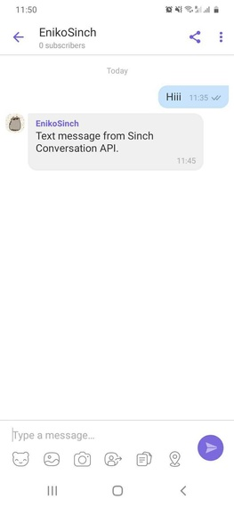
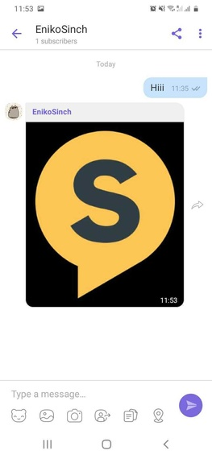
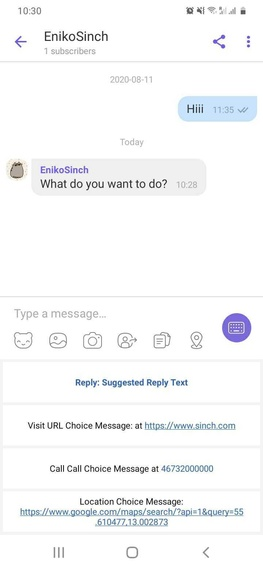
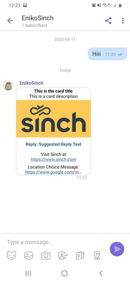
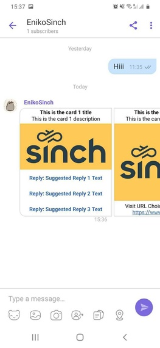
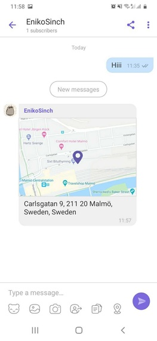

# Viber Bot

Sinch Conversation API Viber Bot specific configurations and message transcoding.

## Conversation API Viber Bot Support

Viber Bot channel enables communication with users of Viber ecosystem through Conversation API.
You need a Viber bot for integrating your Conversation API with Viber. If you don't already
have one follow the steps below to create a new Viber bot:

1. You must have an active Viber account which will be used to administer your new bot. You already have an account if you have Viber app installed and can sign in. Otherwise, go to [Viber download page](https://www.viber.com/en/download/) and select to download the Viber app from the app store of your mobile device.

2. Follow the steps in [Create Viber Bot Page](https://partners.viber.com/account/create-bot-account) to create your new bot. Once your bot is created its authentication token will appear in the account’s “edit info” [screen](https://partners.viber.com/).

## Channel Configuration

The easiest way to configure your Conversation API **app** with Viber support is to use
[Sinch Portal](https://dashboard.sinch.com/convapi/overview). Just select your **app** and
click on "SET UP CHANNEL" beside the Viber Bot channel. You will be asked to enter the
the access token for your Viber bot.

### Setup Viber Bot integration using the API

If you decide to configure your **app** through API calls follow these 2 steps:

1. Update your Conversation API **app** with Viber Bot channel credentials as given in the example snippet below:

  ```json
  {
    "channel_credentials": [
      {
        "channel": "VIBER",
        "static_token": {
          "token": "{{VIBER_BOT_TOKEN}}"
        }
      }
    ]
  }
  ```

  You need to replace {{VIBER_BOT_TOKEN}} with your Viber bot's access token.

  :::info Note

  For Viber Bot you can configure Callback Validation between Viber Bot API and Conversation API so that we can make sure, that the callbacks are valid.

  This can be done via the portal when configuring your Viber Bot channel, or by adding `"callback_secret": "<string>"` to the `"channel_credentials"` object in the snippet above.

  The secret for this validation in the case of Viber Bot is the same as your VIBER_BOT_TOKEN.

  :::
2. Set the webhook for your Viber bot to the URL of the Conversation API adapter using the instructions in the [Viber Bot documentation](https://developers.viber.com/docs/api/rest-bot-api/#setting-a-webhook). This step is done automatically when configuring the Viber integration through the [Sinch Portal](https://dashboard.sinch.com/convapi/overview). The format of the adapter callback URL is: `https://viber-adapter.{{REGION}}.conversation-api.prod.sinch.com/adapter/v1/{{CONVERSATION_APP_ID}}/callback`

  Where {{REGION}} is one of `eu1` or `us1` and must match the region of your **app** while {{CONVERSATION_APP_ID}} is the id of your Conversation API **app**.

  Don't forget to add Conversation API webhooks to your **app** in order to receive delivery receipts and inbound messages. Adding webhooks can be done through the portal or using the management API.

#### Testing the integration

Viber Bot API doesn't allow sending bot messages to Viber users which haven't
subscribed to the bot. For establishing subscription to a bot the Viber users must send a message to the bot.
So to test your integration open the Viber app and search for the name of your Viber bot.
Then send a message to it. You should receive two callbacks on the registered Conversation API webhooks -\
one is `conversation_start_notification` and the other is the actual message send from the handset.
Both callbacks contain a field `contact_id` which is the identifier of the
contact which was automatically created when processing the inbound Viber message.
This contact contains the channel identity for the Viber user and you can use this `contact_id` to reply to the Viber user.
The Viber Bot channel identities are opaque identifiers which are scoped to an app.
This means that the same Viber user will have two different channel identities for
two different Conversation API **apps**. Therefore a Conversation API contact can have multiple
Viber Bot identities - the `/messages:send` endpoint automatically picks the correct
identity which corresponds to the requesting app.

#### Rich Message Support

This section provides detailed information about which rich messages are
natively supported by Vier Bot channel and what transcoding is applied in
other cases.

##### Sending Messages

Here we give a mapping between Conversation API generic message format
and the Viber rendering on mobile devices.
Please note that for the sake of brevity the JSON snippets don't include
the **recipient** and **app_id** which are both required when sending a message.
When sending messages on Viber Bot you can use some channel specific properties, like Viber sender avatar. Check out [**Channel Specific Properties**](/docs/conversation/channel-support/properties.md) for more info.

###### Text Messages

---

Conversation API POST `messages:send`

```json
{
  "message": {
    "text_message": {
      "text": "Text message from Sinch Conversation API."
    }
  }
}
```

The rendered message:



###### Media Messages

---

Conversation API POST `messages:send`

```json
{
  "message": {
    "media_message": {
      "url": "https://1vxc0v12qhrm1e72gq1mmxkf-wpengine.netdna-ssl.com/wp-content/uploads/2018/12/favicon.png"
    }
  }
}
```

The rendered message:



###### Choice Messages

---

Conversation API POST `messages:send`

```json
{
  "message": {
    "choice_message": {
      "text_message": {
        "text": "What do you want to do?"
      },
      "choices": [
        {
          "text_message": {
            "text": "Suggested Reply"
          }
        },
        {
          "url_message": {
            "title": "Sinch",
            "url": "https://www.sinch.com"
          }
        },
        {
          "call_message": {
            "title": "Someone",
            "phone_number": "46732000000"
          }
        }
      ]
    }
  }
}
```

The rendered message:



###### Card Messages

---

Conversation API POST `messages:send`

```json
{
  "message": {
    "card_message": {
      "title": "This is the card title",
      "description": "This is the card description",
      "media_message": {
        "url": "https://1vxc0v12qhrm1e72gq1mmxkf-wpengine.netdna-ssl.com/wp-content/uploads/2019/05/Sinch-logo-Events.png"
      },
      "choices": [
        {
          "text_message": {
            "text": "Suggested Reply"
          }
        },
        {
          "url_message": {
            "title": "Sinch website",
            "url": "https://www.sinch.com"
          }
        },
        {
          "call_message": {
            "title": "John Doe",
            "phone_number": "46732000000"
          }
        }
      ]
    }
  }
}
```

The rendered message:



###### Carousel Messages

---

Conversation API POST `messages:send`

```json
{
  "message": {
    "carousel_message": {
      "cards": [
        {
          "title": "This is the card 1 title",
          "description": "This is the card 1 description",
          "media_message": {
            "url": "https://1vxc0v12qhrm1e72gq1mmxkf-wpengine.netdna-ssl.com/wp-content/uploads/2019/05/Sinch-logo-Events.png"
          },
          "choices": [
            {
              "text_message": {
                "text": "Suggested Reply 1 Text"
              }
            },
            {
              "text_message": {
                "text": "Suggested Reply 2 Text"
              }
            },
            {
              "text_message": {
                "text": "Suggested Reply 3 Text"
              }
            }
          ]
        },
        {
          "title": "This is the card 2 title",
          "description": "This is the card 2 description",
          "media_message": {
            "url": "https://1vxc0v12qhrm1e72gq1mmxkf-wpengine.netdna-ssl.com/wp-content/uploads/2019/05/Sinch-logo-Events.png"
          },
          "choices": [
            {
              "text_message": {
                "text": "Suggested Reply"
              }
            },
            {
              "url_message": {
                "title": "Sinch",
                "url": "https://www.sinch.com"
              }
            }
          ]
        },
        {
          "title": "This is the card 3 title",
          "description": "This is the card 3 description",
          "media_message": {
            "url": "https://1vxc0v12qhrm1e72gq1mmxkf-wpengine.netdna-ssl.com/wp-content/uploads/2019/05/Sinch-logo-Events.png"
          },
          "choices": [
            {
              "call_message": {
                "title": "Someone",
                "phone_number": "46732000000"
              }
            }
          ]
        },
        {
          "title": "This is the card 4 title",
          "description": "This is the card 4 description",
          "media_message": {
            "url": "https://1vxc0v12qhrm1e72gq1mmxkf-wpengine.netdna-ssl.com/wp-content/uploads/2019/05/Sinch-logo-Events.png"
          },
          "choices": [
            {
              "location_message": {
                "title": "Location Choice Message",
                "label": "Enriching Engagement",
                "coordinates": {
                  "latitude": 55.610479,
                  "longitude": 13.002873
                }
              }
            }
          ]
        }
      ]
    }
  }
}
```

The rendered message:



###### Location Messages

---

Conversation API POST `messages:send`

```json
{
  "message": {
    "location_message": {
      "title": "Location Message",
      "label": "Enriching Engagement",
      "coordinates": {
        "latitude": 55.610479,
        "longitude": 13.002873
      }
    }
  }
}
```

The rendered message:



##### Receiving Messages

Viber channel supports various kinds of contact messages - text, media, media card, location and quick replies.
All of these are delivered by Conversation API with POST to `MESSAGE_INBOUND` webhook:

---

Example text reply:

```json
{
  "app_id": "01EB37HMH1M6SV18ASNS3G135H",
  "accepted_time": "2020-10-01T12:06:13.806686Z",
  "event_time": "2020-10-01T12:06:13.254Z",
  "project_id": "c36f3d3d-1513-4edd-ae42-11995557ff61",
  "message": {
    "id": "01EKJ0WGFM7TR314K4D9Y31J5S",
    "direction": "TO_APP",
    "contact_message": {
      "text_message": {
        "text": "This is text message from Viber user."
      }
    },
    "channel_identity": {
      "channel": "VIBER",
      "identity": "9KC0p+pi4zPGDO99ACDxoQ==",
      "app_id": "01EB37HMH1M6SV18ASNS3G135H"
    },
    "conversation_id": "01EKJ0KSWXMVDF05MG9TQ20S06",
    "contact_id": "01EKA07N79THJ20WSN6AS30TMW",
    "metadata": "",
    "accept_time": "2020-10-01T12:06:13.794339Z"
  }
}
```

---

Example location contact message:

```json
{
  "app_id": "01EB37HMH1M6SV18ASNS3G135H",
  "accepted_time": "2020-10-01T12:07:35.513615Z",
  "event_time": "2020-10-01T12:07:34.935Z",
  "project_id": "c36f3d3d-1513-4edd-ae42-11995557ff61",
  "message": {
    "id": "01EKJ0Z07XKM6H04VB5Q941QBP",
    "direction": "TO_APP",
    "contact_message": {
      "location_message": {
        "title": "",
        "coordinates": {
          "latitude": 55.73064,
          "longitude": 13.160131
        },
        "label": ""
      }
    },
    "channel_identity": {
      "channel": "VIBER",
      "identity": "9KC0p+pi4zPGDO99ACDxoQ==",
      "app_id": "01EB37HMH1M6SV18ASNS3G135H"
    },
    "conversation_id": "01EKJ0KSWXMVDF05MG9TQ20S06",
    "contact_id": "01EKA07N79THJ20WSN6AS30TMW",
    "metadata": "",
    "accept_time": "2020-10-01T12:07:35.496355Z"
  }
}
```

---

Example media message:

```json
{
  "app_id": "01EB37HMH1M6SV18ASNS3G135H",
  "accepted_time": "2020-10-01T12:10:55.073703Z",
  "event_time": "2020-10-01T12:10:53.991Z",
  "project_id": "c36f3d3d-1513-4edd-ae42-11995557ff61",
  "message": {
    "id": "01EKJ1534NWK5R02TGWEJN13HA",
    "direction": "TO_APP",
    "contact_message": {
      "media_message": {
        "url": "https://dl-media.viber.com/5/media/2/short/any/sig/image/0x0/e9f1/61be89dcb2a9bc54bf5a998000e33b67e78557a1dc267e9ea4625d344e2ee9f1.jpg?Expires=1601557854&Signature=eCGFLNPPvyoltyO5kp-yZRgGuvdtFfOtehapbiTf9KkUAZ7268GT0YnZ8Mj750IgZhRS7Z~6g6cOZ2wbHcZgPjxfzNWS8F4A8ejWPb1v8crGA1hzaHGmuSWoIxlJguqGOjHvTfUxLOvInkqdCIQ4S8IMq-B65lOV~~iw7HScAXTjarSiua4pGOgdbPvSqULyec6omwJH7IE~4xg0TfuNJSAH4JTRwU4ByGPtkbsJ800VpdK1GA~kHV0vRKRSy2wXPcy6j-i17SX3Le06LYZd1aJNpAxGhgcMgRMsY34SS60~dDtwmnr2QNcktPg61cpK1UVhVwiZ09MfO9~6kmTIZQ__&Key-Pair-Id=APKAJ62UNSBCMEIPV4HA"
      }
    },
    "channel_identity": {
      "channel": "VIBER",
      "identity": "9KC0p+pi4zPGDO99ACDxoQ==",
      "app_id": "01EB37HMH1M6SV18ASNS3G135H"
    },
    "conversation_id": "01EKJ0KSWXMVDF05MG9TQ20S06",
    "contact_id": "01EKA07N79THJ20WSN6AS30TMW",
    "metadata": "",
    "accept_time": "2020-10-01T12:10:55.060170Z"
  }
}
```

---

Example media card message:

```json
{
  "app_id": "01EB37HMH1M6SV18ASNS3G135H",
  "accepted_time": "2020-10-01T12:10:55.073703Z",
  "event_time": "2020-10-01T12:10:53.991Z",
  "project_id": "c36f3d3d-1513-4edd-ae42-11995557ff61",
  "message": {
    "id": "01EKJ1534NWK5R02TGWEJN13HA",
    "direction": "TO_APP",
    "contact_message": {
      "media_card_message": {
        "url": "https://dl-media.viber.com/5/media/2/short/any/sig/image/0x0/e9f1/61be89dcb2a9bc54bf5a998000e33b67e78557a1dc267e9ea4625d344e2ee9f1.jpg?Expires=1601557854&Signature=eCGFLNPPvyoltyO5kp-yZRgGuvdtFfOtehapbiTf9KkUAZ7268GT0YnZ8Mj750IgZhRS7Z~6g6cOZ2wbHcZgPjxfzNWS8F4A8ejWPb1v8crGA1hzaHGmuSWoIxlJguqGOjHvTfUxLOvInkqdCIQ4S8IMq-B65lOV~~iw7HScAXTjarSiua4pGOgdbPvSqULyec6omwJH7IE~4xg0TfuNJSAH4JTRwU4ByGPtkbsJ800VpdK1GA~kHV0vRKRSy2wXPcy6j-i17SX3Le06LYZd1aJNpAxGhgcMgRMsY34SS60~dDtwmnr2QNcktPg61cpK1UVhVwiZ09MfO9~6kmTIZQ__&Key-Pair-Id=APKAJ62UNSBCMEIPV4HA",
        "caption": "caption text"
      }
    },
    "channel_identity": {
      "channel": "VIBER",
      "identity": "9KC0p+pi4zPGDO99ACDxoQ==",
      "app_id": "01EB37HMH1M6SV18ASNS3G135H"
    },
    "conversation_id": "01EKJ0KSWXMVDF05MG9TQ20S06",
    "contact_id": "01EKA07N79THJ20WSN6AS30TMW",
    "metadata": "",
    "accept_time": "2020-10-01T12:10:55.060170Z"
  }
}
```

---

Example quick reply message:

```json
{
  "app_id": "01EGQYR8N9S5VF096DQKYF08JD",
  "accepted_time": "2020-10-01T12:39:48.469849Z",
  "event_time": "2020-10-01T12:39:48.296Z",
  "project_id": "ab5536b1-31b0-45e8-aec6-b35f13c41d0b",
  "message": {
    "id": "01EKJ2SZX9N6F11SJ11G511H6J",
    "direction": "TO_APP",
    "contact_message": {
      "choice_response_message": {
        "message_id": "01EKJ2SWHGDMYA0F0F1PQJ09WQ",
        "postback_data": "suggested"
      }
    },
    "channel_identity": {
      "channel": "VIBER",
      "identity": "+blNgtOp1StVmBEfR3xa5g==",
      "app_id": "01EGQYR8N9S5VF096DQKYF08JD"
    },
    "conversation_id": "01EHY7KA6ZC03C1Q5QTRZ60GDA",
    "contact_id": "01EHY7KA2BYT8A11E6Y2271NHA",
    "metadata": "",
    "accept_time": "2020-10-01T12:39:48.457764Z"
  }
}
```

##### Receiving Delivery Receipts

Messages sent on Viber channel can have three statuses: DELIVERED, READ and FAILED.
If the status is FAILED the reason will include more information about the failure.
Below is an example for DELIVERED receipt - READ and FAILED differ by the
`status` and `reason` only.
Conversation API POST to `MESSAGE_DELIVERY` webhook:

```json
{
  "app_id": "01EB37HMH1M6SV18ASNS3G135H",
  "accepted_time": "2020-10-01T12:10:00.530Z",
  "event_time": "2020-10-01T12:10:03.624Z",
  "project_id": "c36f3d3d-1513-4edd-ae42-11995557ff61",
  "message_delivery_report": {
    "message_id": "01EKJ13DYJX54C0N062N0Q1J9F",
    "conversation_id": "01EKJ0KSWXMVDF05MG9TQ20S06",
    "status": "READ",
    "channel_identity": {
      "channel": "VIBER",
      "identity": "9KC0p+pi4zPGDO99ACDxoQ==",
      "app_id": "01EB37HMH1M6SV18ASNS3G135H"
    },
    "contact_id": "01EKA07N79THJ20WSN6AS30TMW",
    "metadata": ""
  }
}
```
