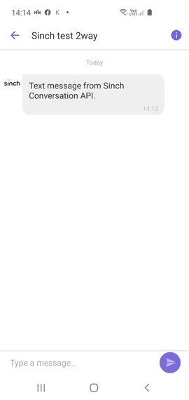
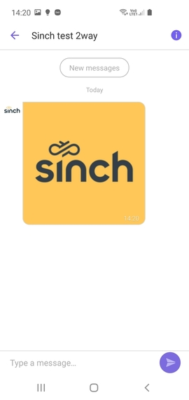
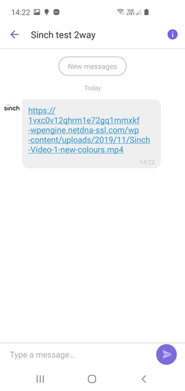
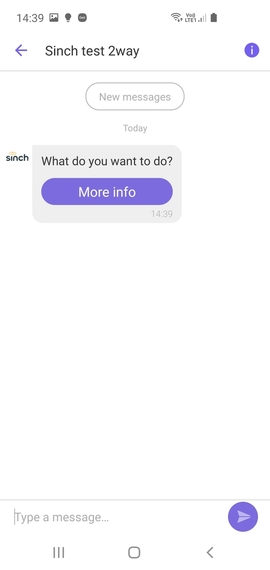
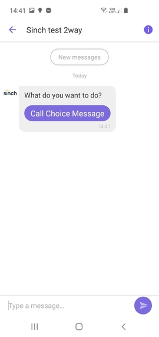
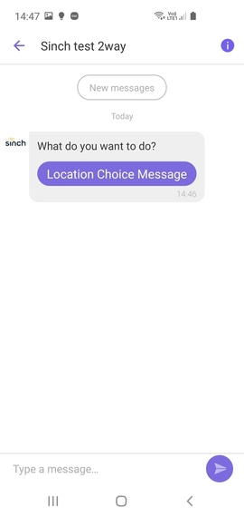
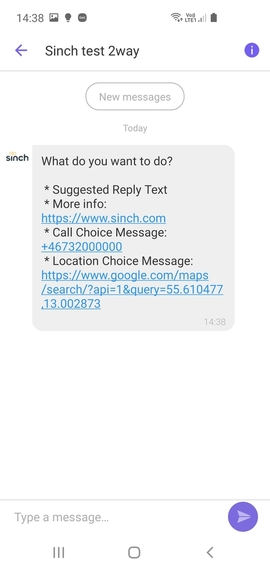
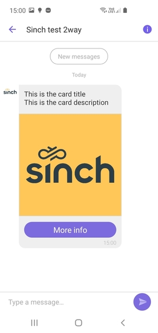
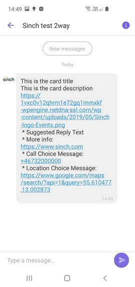
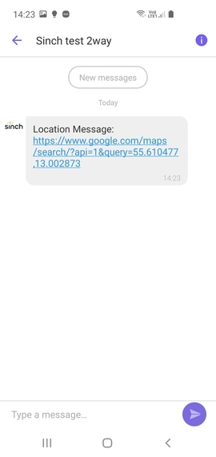

# Viber Business Messages

Sinch Conversation API Viber Business Messages specific configurations and message transcoding.

## Conversation API Viber Business Messages Support

Viber Business Messages (VIBERBM) supports 3 types of business account: 1way, 2way
and session:

- 1way is an account which can send one-way messages only - the contact can't
  enter a reply from the device
- 2way accounts allow contacts to reply
- session accounts can't initiate the conversation to the contact. Instead,
  the conversation must be started by the contact. Session accounts only support
  text and image messages.

For all types of accounts the phone number is the contact identifier of the
recipient of the business messages (channel recipient identity).

Conversation API supports 1way and 2way Viber BM accounts.

### Channel Configuration

You need a Viber Business service plan in order to integrate with VIBERBM
channel. Your account manager can help you with the creation and configuration
of VIBERBM service plan for your Conversation API **app**. You can request this
through the [Sinch Portal](https://dashboard.sinch.com/convapi/overview).
Just select your **app** and click on "SET UP CHANNEL" beside the Viber Business Messages channel.
You will receive a Viber Business service id which you can then use in the
[Sinch Portal](https://dashboard.sinch.com/convapi/overview) to finish the
Viber Business Messages integration for your Conversation API **app**.
Alternatively you can use the management API to configure your **app** with
`channel_credentials` for VIBERBM channel. The example snippet below
shows the credentials configuration for VIBERBM channel:

```json
{
  "channel_credentials": [
    {
      "channel": "VIBERBM",
      "static_bearer": {
        "claimed_identity": "{{VIBERBM_SERVICE_ID}}"
      }
    }
  ]
}
```

You need to replace `{{VIBERBM_SERVICE_ID}}` with your VIBERBM service ID.

Don't forget to create at least one Conversation API webhook which
will trigger POST callbacks to the given URL. You can do that from the
[Sinch Portal](https://dashboard.sinch.com/convapi/overview) or programmatically
using the management API.

#### Rich Message Support

This section provides detailed information about which rich messages are
natively supported by VIBERBM channel and what transcoding is applied in
other cases.

##### Sending Messages

Here we give a mapping between Conversation API generic message format
and the VIBERBM rendering on mobile devices.
Please note that for the sake of brevity the JSON snippets don't include
the **recipient** and **app_id** which are both required when sending a message.

###### Text Messages

Text messages are natively supported by VIBERBM channel. The maximum length of the text is 1000 characters, longer content will be truncated.

---

Conversation API POST `messages:send`

```json
{
  "message": {
    "text_message": {
      "text": "Text message from Sinch Conversation API."
    }
  }
}
```

The rendered message:



###### Media Messages

VIBERBM supports Image messages natively. Supported image types are JPG, JPEG and PNG.

---

Conversation API POST `messages:send`

```json
{
  "message": {
    "media_message": {
      "url": "https://1vxc0v12qhrm1e72gq1mmxkf-wpengine.netdna-ssl.com/wp-content/uploads/2019/05/Sinch-logo-Events.png"
    }
  }
}
```

The rendered message:



---

Video and other types of media messages render as a link:



###### Choice Messages

VIBERBM channel provides native support for single choice (URL, Call, or Location) **Choice Messages**.
The title of the choice has a maximum length of 30 characters, longer content will be truncated.

---

**URL Choice**

Conversation API POST `messages:send`

```json
{
  "message": {
    "choice_message": {
      "text_message": {
        "text": "What do you want to do?"
      },
      "choices": [
        {
          "url_message": {
            "title": "More info",
            "url": "https://www.sinch.com"
          }
        }
      ]
    }
  }
}
```

The rendered message:



---

**Call Choice**

Call choice renders a button which opens Viber keypad with the phone
number in the request.

```json
{
  "message": {
    "choice_message": {
      "text_message": {
        "text": "What do you want to do?"
      },
      "choices": [
        {
          "call_message": {
            "title": "Call Choice Message",
            "phone_number": "+46732000000"
          }
        }
      ]
    }
  }
}
```

The rendered message:



---

**Location Choice**

Location choice renders a button which opens Google Maps with the coordinates
of the location.

```json
{
  "message": {
    "choice_message": {
      "text_message": {
        "text": "What do you want to do?"
      },
      "choices": [
        {
          "location_message": {
            "title": "Location Choice Message",
            "label": "Enriching Engagement",
            "coordinates": {
              "latitude": 55.610479,
              "longitude": 13.002873
            }
          }
        }
      ]
    }
  }
}
```

The rendered message:



---

**Text Choice or Multiple Choices**

There is no native support for suggested replies or multiple choices in VIBERBM.

```json
{
  "message": {
    "choice_message": {
      "text_message": {
        "text": "What do you want to do?"
      },
      "choices": [
        {
          "text_message": {
            "text": "Suggested Reply"
          }
        },
        {
          "url_message": {
            "title": "URL Choice Message:",
            "url": "https://www.sinch.com"
          }
        },
        {
          "location_message": {
            "title": "Location Choice Message",
            "label": "Enriching Engagement",
            "coordinates": {
              "latitude": 55.610479,
              "longitude": 13.002873
            }
          }
        }
      ]
    }
  }
}
```

The rendered message:



###### Card Messages

VIBERBM supports natively Card messages with one URL, Call, or Location choice.
The media message in the Card should point to an image.
The title of the choice in the Card message has a maximum length of 30 characters, longer content will be truncated.

---

Conversation API POST `messages:send`

```json
{
  "message": {
    "card_message": {
      "title": "This is the card title",
      "description": "This is the card description",
      "media_message": {
        "url": "https://1vxc0v12qhrm1e72gq1mmxkf-wpengine.netdna-ssl.com/wp-content/uploads/2019/05/Sinch-logo-Events.png"
      },
      "choices": [
        {
          "url_message": {
            "title": "More info",
            "url": "https://www.sinch.com"
          }
        }
      ]
    }
  }
}
```

The rendered message:



---

Card messages with non-image media, multiple choices or a single suggested reply choice render
as text:



###### Carousel Messages

VIBERBM doesn't support natively Carousel messages and this is why they're
transcoded and sent as text message by Conversation API.

---

Conversation API POST `messages:send`

```json
{
  "message": {
    "carousel_message": {
      "cards": [
        {
          "title": "This is the card 1 title",
          "description": "This is the card 1 description",
          "media_message": {
            "url": "https://1vxc0v12qhrm1e72gq1mmxkf-wpengine.netdna-ssl.com/wp-content/uploads/2019/05/Sinch-logo-Events.png"
          },
          "choices": [
            {
              "text_message": {
                "text": "Suggested Reply 1 Text"
              }
            },
            {
              "text_message": {
                "text": "Suggested Reply 2 Text"
              }
            },
            {
              "text_message": {
                "text": "Suggested Reply 3 Text"
              }
            }
          ]
        },
        {
          "title": "This is the card 2 title",
          "description": "This is the card 2 description",
          "media_message": {
            "url": "https://1vxc0v12qhrm1e72gq1mmxkf-wpengine.netdna-ssl.com/wp-content/uploads/2019/05/Sinch-logo-Events.png"
          },
          "choices": [
            {
              "text_message": {
                "text": "Suggested"
              }
            },
            {
              "url_message": {
                "title": "Sinch",
                "url": "https://www.sinch.com"
              }
            }
          ]
        }
      ]
    }
  }
}
```

The rendered message:


###### Location Messages

VIBERBM doesn't support natively Location messages and so they're
transcoded and sent as text message by Conversation API.

---

Conversation API POST `messages:send`

```json
{
  "message": {
    "location_message": {
      "title": "Location Message",
      "label": "Enriching Engagement",
      "coordinates": {
        "latitude": 55.610479,
        "longitude": 13.002873
      }
    }
  }
}
```

The rendered message:



##### Receiving Messages

VIBERBM supports contact initiated messages and choice responses.

Conversation API POST to `MESSAGE_INBOUND` webhook for text message:

```json
{
  "app_id": "01E3S8B6YCMRNR0GGM94H80ACX",
  "accepted_time": "2020-04-24T08:02:50.184581Z",
  "message": {
    "id": "01E6NKBV63YG6K01ENEW7S1N80",
    "direction": "TO_APP",
    "contact_message": {
      "text_message": {
        "text": "Hi from contact"
      }
    },
    "channel": "VIBERBM",
    "conversation_id": "01E6K4A8PGZ6MV0GD3C7M901MZ",
    "contact_id": "01E6K4A8N3NANZ05VM0FS80EHD",
    "metadata": "",
    "accept_time": "2020-04-24T08:02:50.179021Z"
  }
}
```

Conversation API POST to `MESSAGE_INBOUND` webhook for choice response message:

```json
{
  "app_id": "01E3S8B6YCMRNR0GGM94H80ACX",
  "accepted_time": "2020-04-24T08:02:50.184581Z",
  "message": {
    "id": "01E6NKBV63YG6K01ENEW7S1N80",
    "direction": "TO_APP",
    "contact_message": {
      "choice_response_message": {
        "message_id": "01EKJ2SWHGDMYA0F0F1PQJ09WQ",
        "postback_data": "postback"
      }
    },
    "channel": "VIBERBM",
    "conversation_id": "01E6K4A8PGZ6MV0GD3C7M901MZ",
    "contact_id": "01E6K4A8N3NANZ05VM0FS80EHD",
    "metadata": "",
    "accept_time": "2020-04-24T08:02:50.179021Z"
  }
}
```

##### Receiving Delivery Receipts

Messages sent on VIBERBM channel have three statuses: DELIVERED, READ and FAILED.
Below is an example for DELIVERED receipt - READ and FAILED differ by the
`status` and `reason` only.
Conversation API POST to `MESSAGE_DELIVERY` webhook:

```json
{
  "app_id": "01E3S8B6YCMRNR0GGM94H80ACX",
  "accepted_time": "2020-04-23T09:55:04.766Z",
  "message_delivery_report": {
    "message_id": "01E6K7CMXY3KHH0AGCTY6D04F2",
    "conversation_id": "01E6JY5HMCADX31SANQ0YE0CH6",
    "status": "DELIVERED",
    "channel": "VIBERBM",
    "reason": "",
    "metadata": ""
  }
}
```

##### Receiving User Opt-In/Out

Viber users can at any time opt-in or opt-out of receiving messages by given VIBERBM account.

###### Opt-In

Conversation API POST to `UNSUPPORTED` webhook:

```json
{
  "app_id": "01E3S8B6YCMRNR0GGM94H80ACX",
  "accepted_time": "2020-04-24T08:06:04.078344Z",
  "unsupported_callback": {
    "channel": "VIBERBM",
    "payload": "{\"message_token\":\"5434382642129923939\",\"message_status\":4,\"message_time\":1587715563958,\"phone_number\":\"46702470247\",\"service_id\":111}"
  }
}
```

###### Opt-Out

Conversation API POST to `UNSUPPORTED` webhook:

```json
{
  "app_id": "01E3S8B6YCMRNR0GGM94H80ACX",
  "accepted_time": "2020-04-24T08:06:57.176156Z",
  "unsupported_callback": {
    "channel": "VIBERBM",
    "payload": "{\"message_token\":\"5434382864469978544\",\"message_status\":5,\"message_time\":1587715616968,\"phone_number\":\"46702470247\",\"service_id\":111}"
  }
}
```
