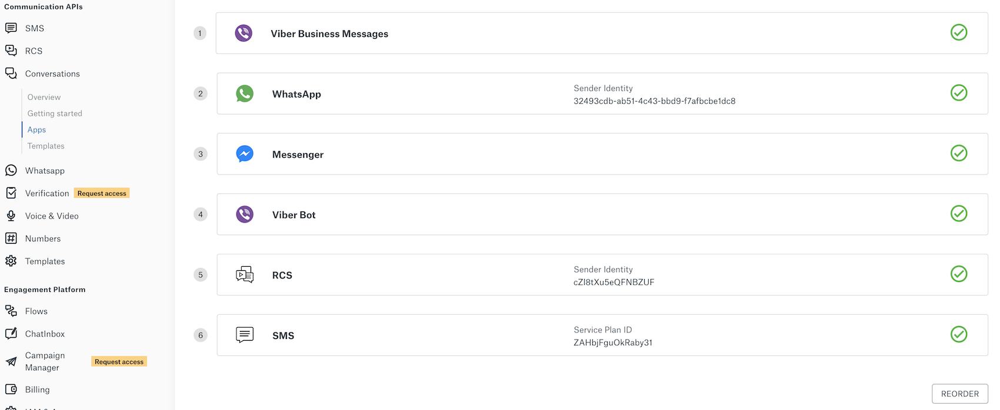
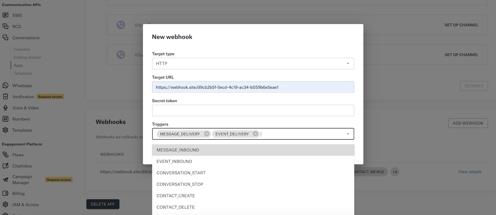
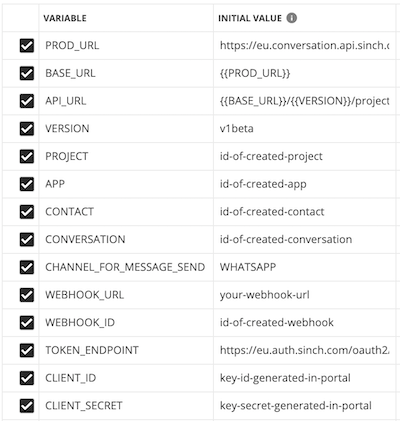

# Getting started

In this tutorial, you'll create and configure your first Conversation API app in the Sinch dashboard.

## Things you'll need

- [Channels](channel-support.md) that are set up and registered to be included in the Conversation API.
- Service plan ID/Service ID/Sender Identity set up at corresponding channel portals.
- **Access keys** and **Project ID** which can be found in the [Sinch dashboard](https://dashboard.sinch.com/settings/access-keys).

## Step One: Creating a new App

Create a new app in the Sinch dashboard.

1. Go to the [Apps page](https://dashboard.sinch.com/convapi/apps).
2. Click **NEW APP**.
3. Add a display name and select US or EU from the **Region** drop-down.

:::info Note

Once you've created an App, you can't move it to another region.

:::

Once a display name is created and a region is selected, a unique App ID will be generated for you.

## Step Two: Select and add channels

Select which channels you want and add them to your app.

1. Select your channel sender identity, if required, to configure your channel to work with your Conversation API App.
2. Update the Callback URL of the underlying channel to point to the channel adapter of the Conversation API.

The Callback URL for most channels will be updated automatically which will overwrite the current Callback URL.

:::info Note

Some channels require an access token or more, like Messenger or Viber. Please visit the [Messenger](https://developers.sinch.com/docs/conversation-facebook-messenger) or [Viber](https://developers.sinch.com/docs/conversation-viber-bot) documentation on how to set up these channels and acquire the token.

:::

## Step Three: Reordering and prioritizing channels

The Conversation API will try to send messages on the channels based on the priority preference you set. If there is no preference set, the API will try the order priority based on the following criteria:

1. If a conversation with the contact exists: the active channel of the conversation is tried first.
2. The existing channels for the contact, that are ordered by contact channel preferences (if given).
3. Lastly the existing channels for the contact are ordered by the App priority.

You can define the App channel priority by reordering the channels that you have set up by taking these steps:

1. Click **REORDER**.
2. Drag and drop your channels to the order you want them in.
3. Click **SAVE**.

## Step Four: Add and configure webhooks

[**Webhooks**](keyconcepts.md#webhook) are callbacks triggered by specific events. When adding a Webhook you are prompted to specify a Target URL and events that should trigger a call to the specified URL. To configure webhooks:

1. Go to [Webhook.site](https://webhook.site/) and copy a target URL.
2. Go to [Apps](https://dashboard.sinch.com/convapi/apps) and click your app name.
3. Scroll down and click **ADD WEBHOOK**.
4. Select your **Target type**, **Target URL**, **Secret token** and **Triggers**

:::info Note

The Secret Token can be used to sign the content of Conversation API callbacks. This way you can verify the integrity of the callbacks coming from Conversation API.

:::

## Step Five: Project ID and Access keys

Your **Project ID** is used to group your Conversation API resources. You can find it by taking these steps:

1. Go to your [app page](https://dashboard.sinch.com/convapi/apps).
2. In the **Project** pane, select the project you want to use and copy the **Project ID** that appears.

**Access keys** are required for authentication purposes when using the Conversation API. To generate that access keys, take these steps:

1. Go to the **Account details** [page](https://dashboard.sinch.com/settings/account-details) and then go to **Settings** > **Access Keys** and click **NEW KEY**.

A **client_id** and **client_secret** will be provided when creating an Access Key in the portal. The secret is only shown after generation, copy and store it in a safe place.

To obtain an Access Token to Conversation API, use your client_id and client_secret and call the OAuth 2.0 Token endpoint:

EU region:

    curl https://eu.auth.sinch.com/oauth2/token -d grant_type=client_credentials --user <client_id>:<client_secret>

US region:

    curl https://auth.sinch.com/oauth2/token -d grant_type=client_credentials --user <client_id>:<client_secret>

The access token can be used in conjunction with your project ID to interact with the Conversation API. Read more about possible authentication methods at [**Authentication**](/docs/conversation/index.md#authentication).

## Step Six: Try our Postman collection

A [**Postman collection**](/docs/conversation/index.md#postman-collection) is available to download. There you can find examples to access our API endpoints.

In the collection there are variables that you need to fill with your own values and IDs to be able to send the requests:

The collection includes requests to manage your resources and to create the same Conversation App that we created on the portal via these requests!

Available Services:

- `APP` Management

- `CONTACT` Management

- `CONVERSATION` Management

- `WEBHOOK` Management

You will also find requests to send **messages and events** to your contact via

    * `TEXT`

    * `MEDIA`

    * `CHOICE`

    * `CARD`

    * `CAROUSEL`

    * `LOCATION`

    * `EVENT`

## Step Seven: Send Messages

**Conversation API** integrates multiple channels that you can try. [**Channel Support**](/docs/conversation/channel-support.md) contains detailed examples and screenshots about message types that you can try on supported channels!
