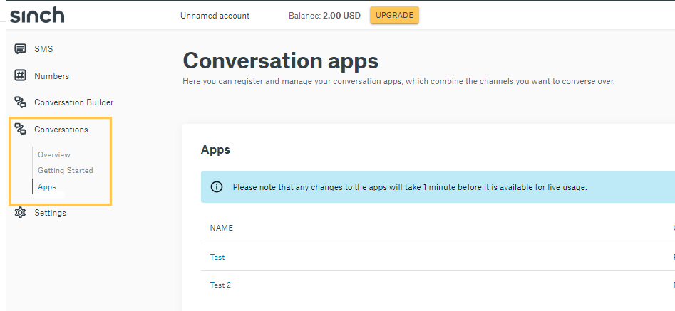
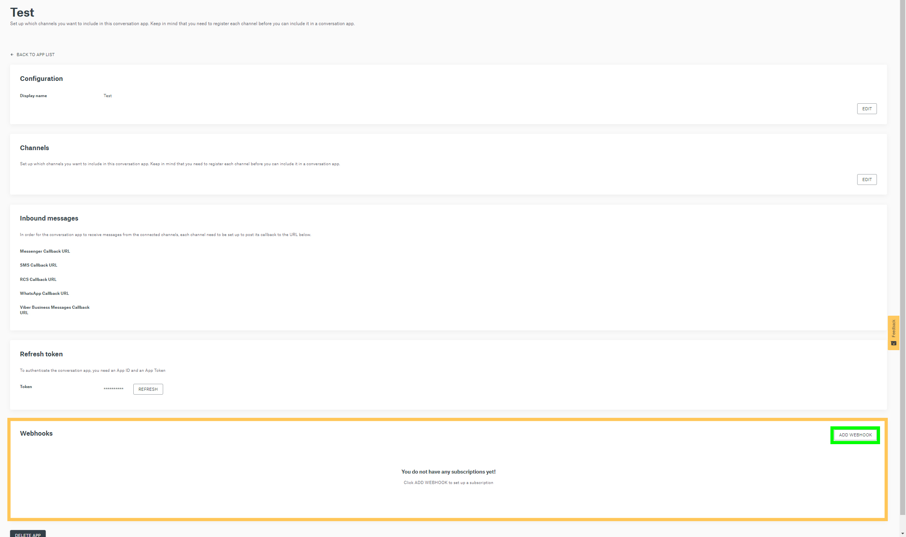
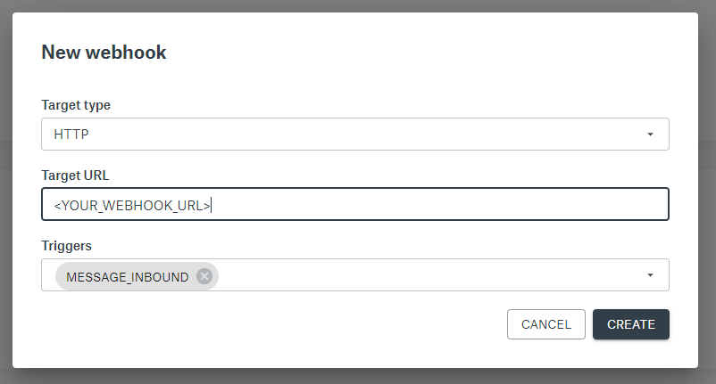
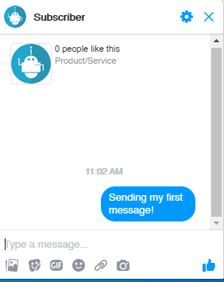
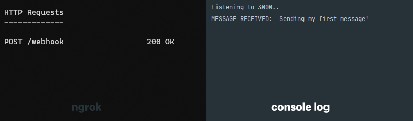
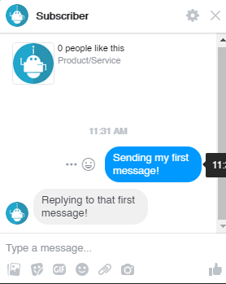

# Handle incoming messages

In this guide you will learn how to handle incoming messages.

In this guide we use [Facebook Messenger](/docs/conversation/getting-started/send-a-message-with-fb-messenger.md), if you'd like, you can use the [SMS channel](send-sms.md) or any [other channel](../channel-support.md)

## Create a simple webhook using Node.js

First, create a new node app and then run the following on the command line to create the needed dependency.

**Note**: You will need to use the right region api endpoint where your Conversation App resides. In this guide, we assume our app resides in the EU region.

`npm install express body-parser --save` This will install the [Express](https://www.npmjs.com/package/express) http server framework module.

Now add the following code to your index.js

```javascript
const express = require("express"),
  bodyParser = require("body-parser"),
  app = express().use(bodyParser.json());
port = 3000;

app.post("/webhook", (req, res) => {
  let body = req.body;
  let {
    message: {
      contact_message: {
        text_message: { text },
      },
    },
  } = body;
  console.log(text);
  res.sendStatus(200);
});

app.listen(port, () => console.log(`Listening to ${port}..`));
```

This code will allow you to listen for incoming messages and will parse out the text message content.
If you want to see the payload not parsed, add `console.log(JSON.stringify(body, null, 2));`

Before you can handle incoming traffic to your local server, you need to open up a tunnel to your local server, for that you can use an [ngrok](https://ngrok.com/) tunnel. Open a terminal/command prompt and type: `ngrok http 3000`

The Node app and Ngrok should be running at the same time at port 3000.


## Configure a webhook

Go to your Conversation App dashboard and select **Conversations** on the left side menu. Then select **Apps** from the drop-down menu and select the App you want to add a webhook too.



Once you have selected your App, scroll down to the **Webhook** section and click **Add Webhook**. There will be a pop-up with empty required fields.



Fill in the following:

Select **Target Type** to HTTP

Select **Target URL** as your ngrok url

Select `MESSAGE_INBOUND`, `MESSAGE_DELIVERY`, `EVENT_DELIVERY`, `MESSAGE_INBOUND`, `EVENT_INBOUND`, `CONVERSATION_START`, `CONVERSATION_STOP`, `UNSUPPORTED` as **Trigger**



Now your webhook is setup with the Conversation App.

---

## Start a Conversation

Now that your webhook is setup with the Conversation App and ngrok, and your node app is running and listening to port 3000, it's time to test the webhook.

For this demo, we will be using the Facebook Messenger channel as our example. Open up Facebook Messenger and send a message to your test account. If you don't have an account, please visit [Send a message with Facebook Messenger](send-a-message-with-fb-messenger.md) before proceeding.



If you did everything correctly, you will receive a `status 200 OK` on ngrok and the text message on your console log.



---

## Sending a reply via Webhook

Copy the following code on top of your current webhook and then re-run your node application.

```javascript
const express = require("express");
const request = require("request-promise");
const bodyParser = require("body-parser");
app = express().use(bodyParser.json());
port = 3000;

const APP_ID = "APP_ID_HERE",
  PROJECT_ID = "PROJECT_ID_HERE",
  client_id = "CLIENT_ID_HERE",
  client_secret = "CLIENT_SECRET_HERE";

/* Note that client id and secret are essentially equivalent to a username and password. This code is for example purposes and is not meant for production.*/

const getAuthToken = () => {
  return request({
    url: "https://auth.sinch.com/oauth2/token",
    method: "POST",
    auth: { user: client_id, pass: client_secret },
    form: { grant_type: "client_credentials" },
    json: true,
  });
};

const sendMessage = async (contact_id, text) => {
  const res = await getAuthToken();
  const token_type = res.token_type;
  const token = res.access_token;
  return request({
    url: `https://eu.conversation.api.sinch.com/v1beta/projects/${PROJECT_ID}/messages:send`,
    method: "POST",
    headers: {
      "Content-Type": "application/json text/plain",
      Authorization: `${token_type} ${token}`,
    },
    body: {
      app_id: APP_ID,
      recipient: {
        contact_id,
      },
      message: {
        text_message: {
          text,
        },
      },
      channel_priority_order: ["MESSENGER"],
    },
    json: true,
  });
};

app.post("/webhook", (req, res) => {
  let body = req.body;
  let {
    message: {
      contact_message: {
        text_message: { text },
      },
      contact_id,
    },
  } = body;
  if (text) {
    sendMessage(contact_id, "Hello World").then((res) => console.log(res));
  }
  console.log(`MESSAGE RECEIVED: ${text}`);
  res.sendStatus(200);
});

app.listen(port, () => console.log(`Listening to ${port}..`));
```

If everything is done correctly, you will receive a message back from your webhook on Messenger. On your terminal, you will receive data regarding the `message id` and `accepted time`



Now your webhook is ready to receive and send a message back.

If you want to send something other than a text message on Messenger, refer to [Sending a Rich message with Facebook Messenger](send-rich-messages-with-fb-messenger.md)
