# Send a Facebook Messenger message

In this guide, you will learn how to create and configure a basic Facebook Business Page with Messenger chat feature. Once you complete the steps below, you will have a Facebook App, Facebook Business page with Messenger Chat button, a Messenger Token, and a configured Messenger Webhook to use with the Sinch Conversation API.

## Set up a Facebook Page

A Facebook page is required to use the Facebook Messenger API. It's used as the identity of your Messenger experience. When people chat with your app, they will see the page name and the page profile picture. To create a new page, visit <https://www.facebook.com/pages/create>. If you already have one, you can skip to [**Creating your Facebook App**](#create-your-facebook-app).

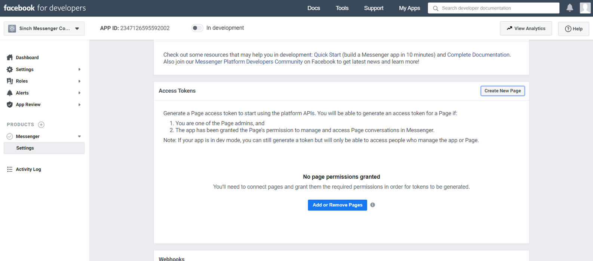

Next, choose to create a **Business or Brand** and fill out the ensuing page name and contact form.

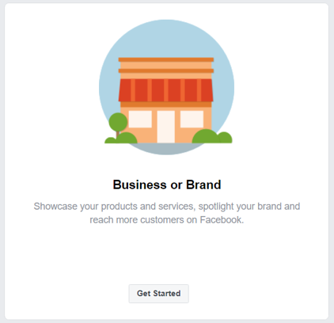

You can choose to **Skip** adding a profile and background pictures as well as, **Not Now** for the option to **Add online booking**. You have now completed creating your Facebook Business page.

Remember, while your Facebook App is **In development**, the Facebook Business page is not visible to anyone except you and other developers you invite to your Facebook developer account.

Make sure to bookmark your Facebook Business page. You will head back there to send messages later.

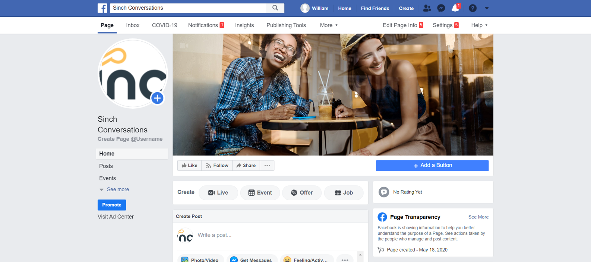

## Add a Messenger Chat Button to your Facebook Business Page

Click **+ Add Button**.

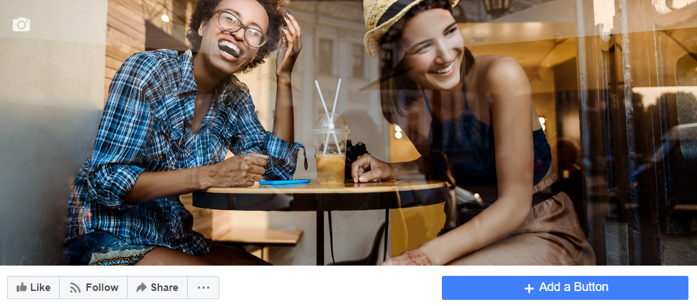

Choose **Send Message** and click **Next**.

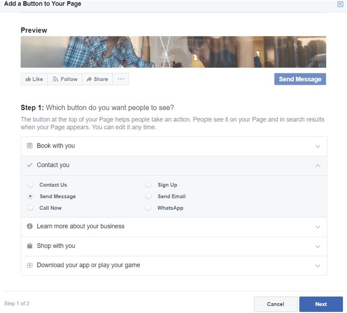

Click **Messenger** and then click **Finish**.

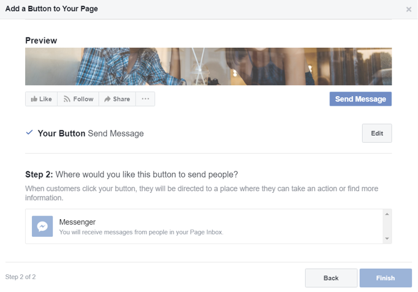

## Create your Facebook App

If you have an existing Facebook Developer account and a Facebook App, you can skip to [Add Messenger Product to your FB App](#add-messenger-to-your-app).

To register for a Facebook Developer account, go to **[Facebook Developer Account](https://developers.facebook.com)** and click **Get Started** in the upper right menu.

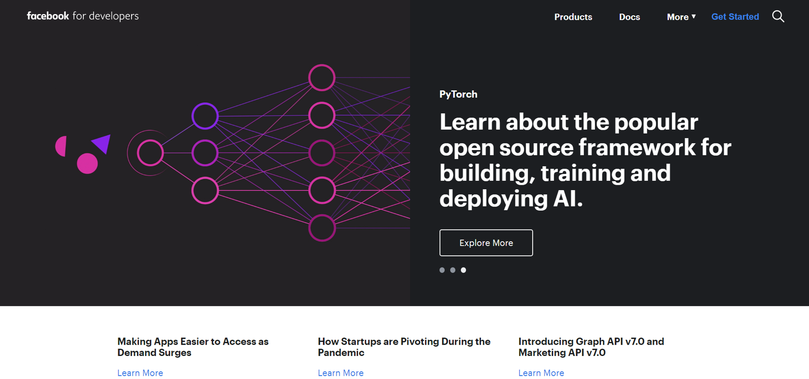

Once you have created your Facebook developer account, you can choose to **Create First App**.

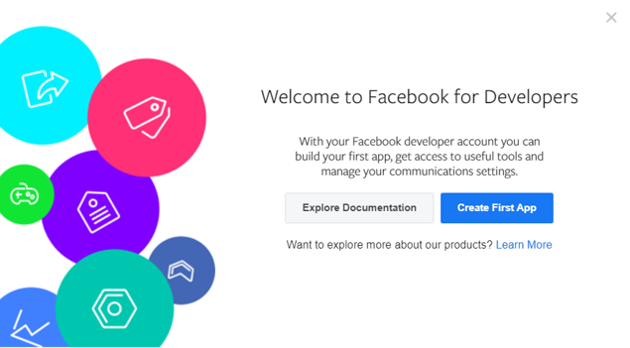

Your new _APP ID_ will be displayed at the top left of your Facebook App dashboard.

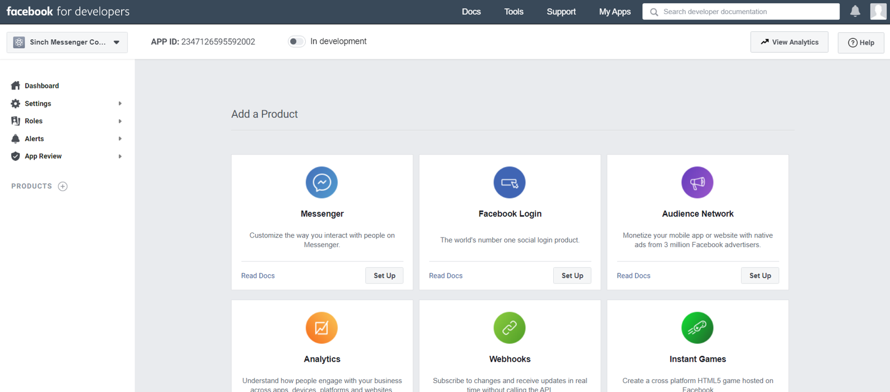

## Add Messenger to your app

From your Facebook Developer dashboard, under _Add Product_, click the Messenger **Setup** button.

## Generate your Messenger API Token

To generate your Messenger API Token, add the Facebook page you created earler. Scroll down to **Access Tokens** and click **Add or Remove Pages**.

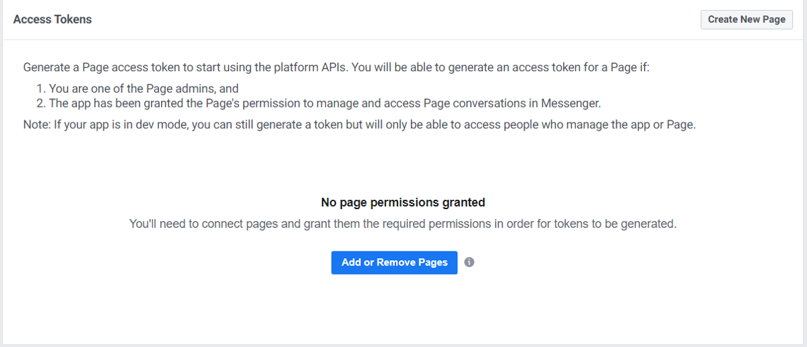

Next, follow the prompts and choose the new Facebook page you just created. Make sure that you leave the default setting **Manage and access Page conversations in Messenger** set to YES.

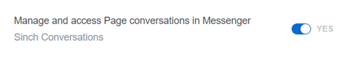

You should see your Facebook page listed under **Access Tokens**. Click the **Generate Token** button.

Copy and store your Messenger Token somewhere safe, you will need it to add the Messenger Channel to your **Sinch Conversations App**.

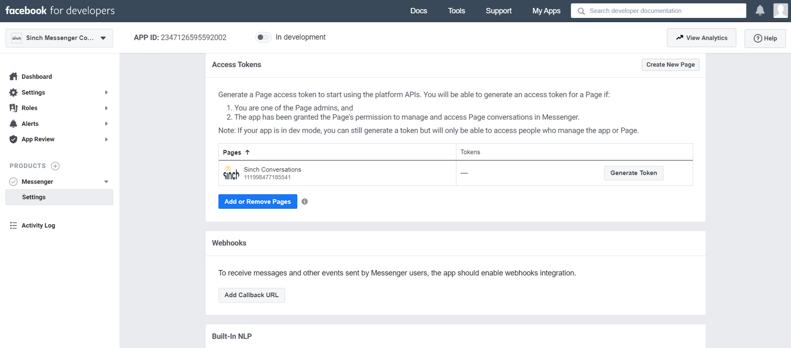

## Configure your Facebook Messenger Channel on the Sinch Conversation API

The easiest way to configure your channel is through the **App Details** page in the [Sinch Portal](https://dashboard.sinch.com/convapi/apps):

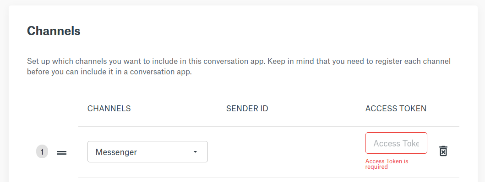

Another way is to use the **app** management API to **Patch** your Sinch Conversations App with the newly created **Messenger Token**, this will allow the Sinch Conversations App to send messages to visitors of your Facebook page.

```shell Curl
curl --location --request PATCH 'https://eu.conversation.api.sinch.com/v1beta/projects/{project_id}/apps' \
--header 'Content-Type: application/json' \
--header 'Authorization: Bearer <access token>' \
--data-raw '{
    "channel_credentials": [
        {
            "channel": "MESSENGER",
            "static_token": {
                "token": "{{YOUR_FB_PAGE_MESSENGER_TOKEN}}"
            }
        }
    ],
    "display_name": "Messages"
}'
```

## Configure the Messenger Webhook

The Messenger Webhook Settings configuration forwards message events posted on your Facebook page to your **Sinch Conversations App**. To set the configuration, click **Add Callback URL** in the Facebook App Dashboard > Products > Messenger > Settings **Webhooks**.


Then, add the following **Callback URL** and **Verify Token**:

```shell Curl Callback URL:
https://messenger-adapter.conversation-api.prod.sinch.com/adapter/v1/{{YOUR_SINCH_CONVERSATION_APP_ID}}/callback

Verify Token: 5651d9fd-5c33-4d7a-aa37-5e3e151c2a92
```

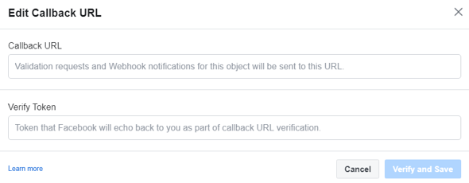

To complete your **Webhooks** configuration, click **Add Subscriptions**. Select **messages** and **message_deliveries** fields and click **Save**.

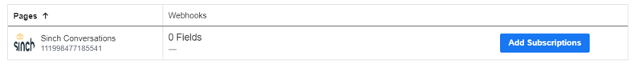

Great! You're almost there. Just a couple more steps.

### Start a conversation in Messenger and respond with the Sinch Conversation API

OK, you are ready for some action! Visit your Facebook page, click **Send Message** and choose **Test Button**.

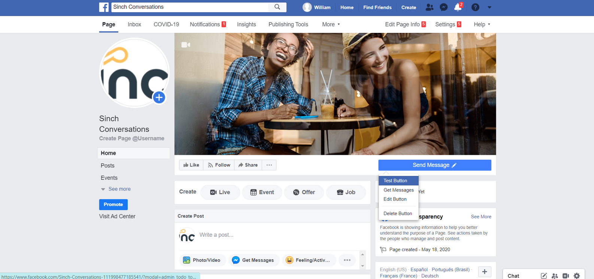

Enter a message into the **Messenger** chat window and **Send**.

:::warning Warning

Note that there's a standard messaging window of 24h on Messenger. To be able to send messages outside this response window check out [**Channel Specific Properties**](../channel-support/properties.md) for more info.

:::

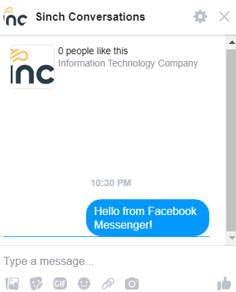

Use the **Sinch Conversation API** to **List Contacts**. You should now see a new contact entry generated when the **Messenger message** was posted from your Facebook page.

```json
{
    "contacts": [
        {
            "id": "J69H07BDS8G11RDF01E96CW660",
            "channel_identities": [
                {
                    "channel": "MESSENGER",
                    "identity": "7746490198930851",
                    "app_id": "3FDS0PWWERGN1QX101E75WGS3Y"
                }
            ],
            "channel_priority": [
                "MESSENGER",
            ],
            "display_name": "",
            "email": "",
            "external_id": "",
            "metadata": ""
        }
    ],
    "next_page_token": ""

```

Use your newly created Sinch **Contact** to send a **Text Message** response by using the **message:send** function.

```shell Curl
curl --location --request POST 'https://eu.conversation.api.sinch.com/v1beta/projects/{project_id}/messages:send' \
--header 'Content-Type: application/json' \
--header 'Authorization: Bearer <access token>' \
--data-raw '{
    "app_id": "{{YOUR_SINCH_APP_ID}}",
    "recipient": {
        "contact_id": "{{YOUR_SINCH_CONTACT_ID}}"
    },
    "message": {
        "text_message": {
            "text": "Greetings from Sinch Conversation API!"
        }
    },
    "channel_priority_order": [
        "MESSENGER"
    ]
}'
```


**CONGRATULATIONS**, you have just sent your first Sinch Conversations Messenger message!
