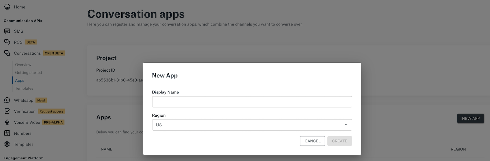
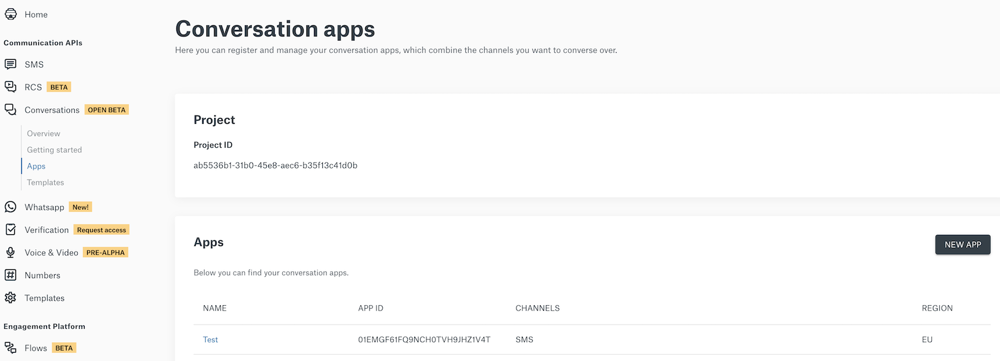
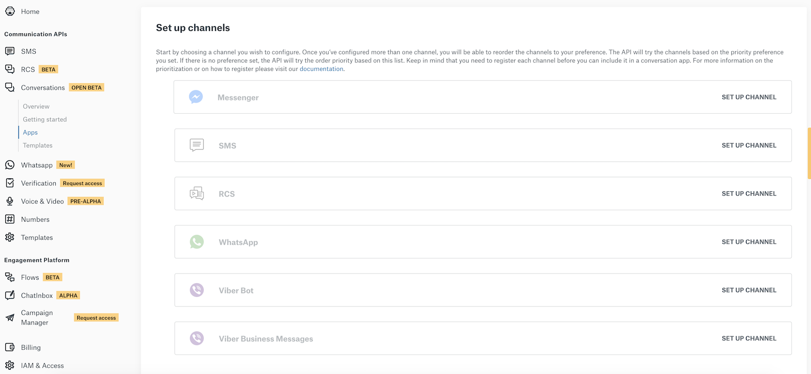
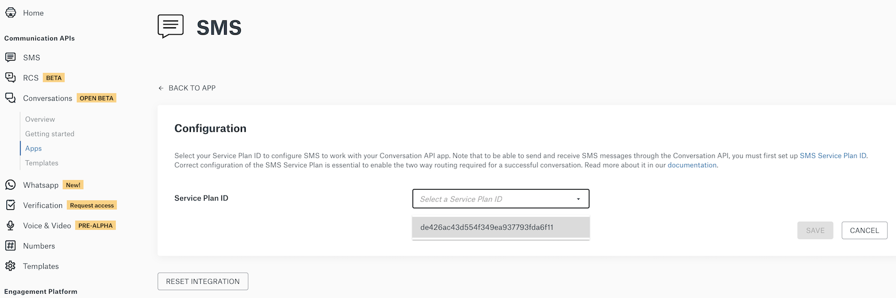
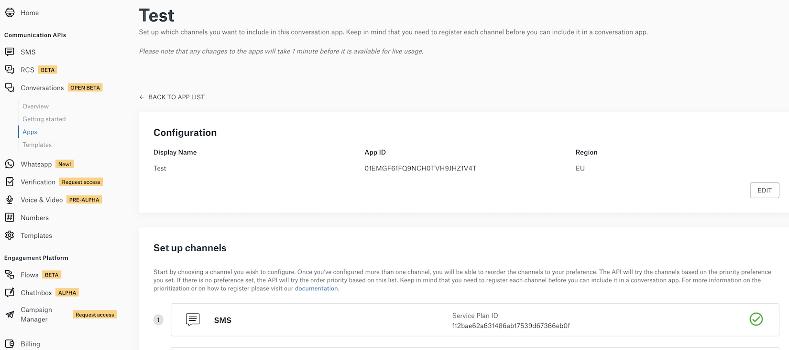
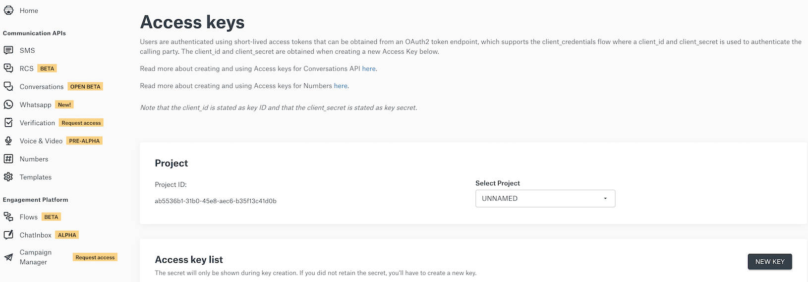

# Send SMS

Learn how to set up and send a message with SMS and Conversation API.

## Add an SMS Channel to your Conversations API App

In this guide, you will learn how to add an SMS channel to your Sinch Conversations API Application. You can add your SMS channel one of two ways: either programmatically via the Sinch Conversation API or through the [Sinch online portal](https://dashboard.sinch.com). Before we begin, here are a few items you should already have:

1. A text enabled _long code_ or a _short code_ registered with Sinch.
2. Access to the Sinch dashboard where you can manage your long code or short code.
3. An SMS **Service Plan ID** and **Secret** to authorize SMS text message requests.
4. A Conversations **App ID**.
5. A Sinch **Project ID** and associated Key ID and Key Secret.

If you are missing any of items 1&ndash;3 above, you should begin by registering online at [_Sinch.com_](https://sinch.com). We'll show you how to create a _New Conversation App_ and get authentication credentials for items 4 and 5.

### Create a New Conversations App

To create a new Conversations App, simply sign in to your [_Sinch Dashboard account_](https://dashboard.sinch.com) and use the menu on the left to access Conversations > Apps.

Click the **New App** button on the right, "Name" your App, choose an appropriate region for it, and click _Create_.



### Add an SMS Channel to your Conversations App

In your Sinch Dashboard, navigate to Conversations > Apps. Click the name of the app that you want to add the SMS Channel to.



Under **Set up channels** find SMS channel and click on **Set Up Channel**.



For setting up the SMS channel, you need to choose your SMS **Service Plan ID** from the drop-down and click **Save**.



You have now added an SMS Channel to your App. Just a few more steps to go.



### Fetch Oauth2 Token needed for authentication

Go to the Access Keys page under Settings and create a new key by clicking the **New Key** button:



Be sure to copy and store in a safe place the Key Secret you will get. You won't be able to retrieve it again once you’ve created the key.

Then use the key id and key secret to obtain an access token:

```shell Curl
curl https://auth.sinch.com/oauth2/token -d grant_type=client_credentials --user <key_id>:<key_secret>
```

Copy the token and use it in the Authorization header of your calls to Sinch Conversations API.

### Send an SMS Message to a Contact

To send an SMS message to a Contact via the Sinch Conversations API App, send an HTTP POST with the following JSON:

```shell Curl
curl --location --request POST 'https://eu.conversation.api.sinch.com/v1beta/projects/{project_id}/messages:send' \
-H 'Content-Type: application/json' \
-H "Authorization: Bearer <access token>"
-d '{
    "app_id": "{{YOUR_APP_ID}}",
    "recipient": {
        "identified_by": {
            "channel_identities": [
                {
                    "channel": "SMS",
                    "identity": "+15551231212"
                }
            ]
        }
    },
    "message": {
        "text_message": {
            "text": "Text message from Sinch Conversation API."
        }
    },
}'
```

When sending SMS messages you can use a channel specific property called `SMS_FLASH_MESSAGE`, check out [**Channel Specific Properties**](../channel-support/properties.md) for more info.
