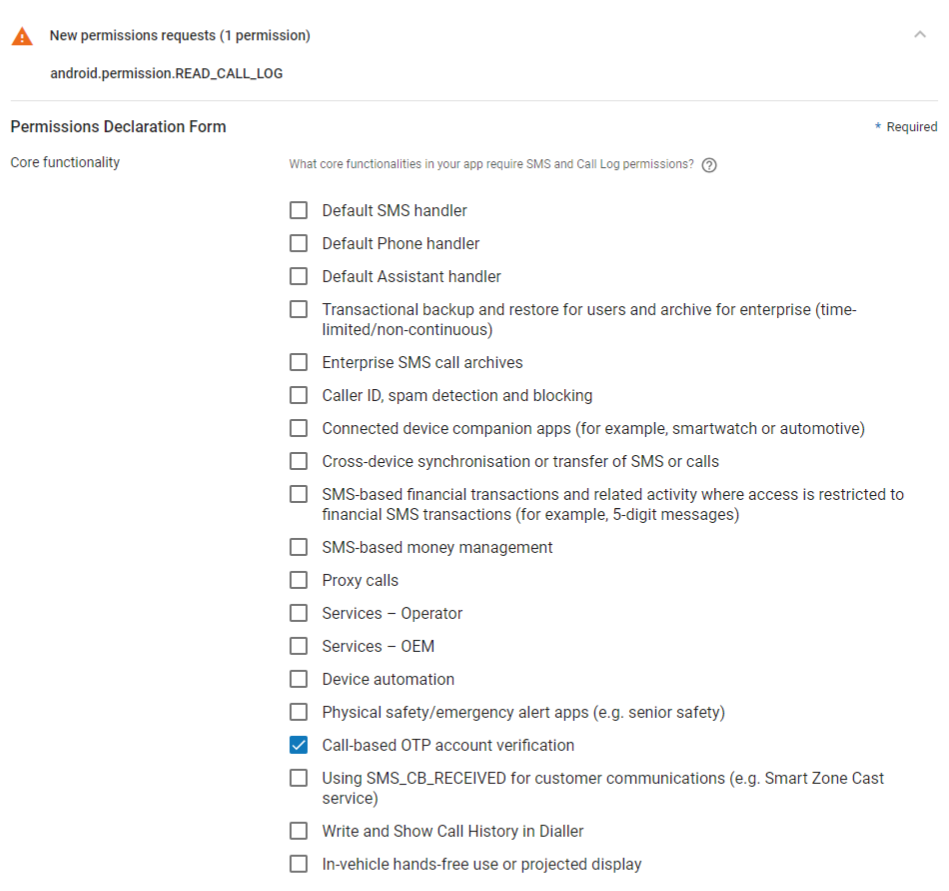

# Verification for Android

Verify phone numbers and users in Android. The Verification SDK supports the verification of phone numbers via SMS or flash calls. The SDK is also available for iOS.

The Sinch Verification SDK makes verifying phone numbers easy. This SDK supports the verification of phone numbers via SMS, flashcalls, callouts and by using mobile data connection.

This document provides an overview for developers integrating with Sinch Verification SDK for the first time. See the [Reference Documentation](http://www.sinch.com/docs/verification/android/reference/) for a comprehensive description of all the classes.

:::info WARNING: Important notice #1 - migration to 2.x.x

Version 2.x.x of the verification SDK is a complete re-write of the library and it **is not** backward compatible. For more information refer to the [first time setup](android/android-first-time-setup.md) and [migration](android/android-all.md) page.

:::

:::info WARNING: Important notice #2 - migration to 1.6.x and using using Flash Calls on Android 9

Due to newly introduced [restrictions for accessing SMS and call logs](https://support.google.com/googleplay/android-developer/answer/9047303?hl=en), users of older versions of this SDK (`1.5.3` and older) need to remove following permissions from their app manifests, when migration to new version of this SDK (`1.6.0` and newer):

```xml
<uses-permission android:name="android.permission.READ_SMS" />
<uses-permission android:name="android.permission.RECEIVE_SMS" />
<uses-permission android:name="android.permission.READ_CALL_LOG" />
```

:::

:::info WARNING: Important notice #3 - using flash calls on Android 9 and newer versions

Removing `<uses-permission android:name="android.permission.READ_CALL_LOG" />` will effectively break the flash call feature on Android 9 and newer. If you plan to use the flash call feature, you’ll need to keep this permission in your manifest. Since this is one of the permissions restricted in normal use, you’ll have to declare how this permission will be used in your app. Below you’ll find a screenshot that shows a properly selected use case for flash calls.

:::



> \*\*WARNING: Important notice #4 - Setting Callback URL \*\*
>
> In order to securely authorize verification requests your application has to have correctly assigned Callback URL inside Sinch Web Portal. More information how callback url works can be found [here](https://developers.sinch.com/docs/verification-rest-callback-api).
