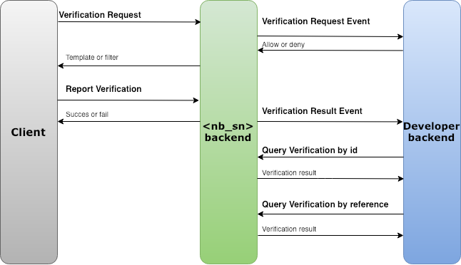

# Introduction

Verify phone numbers with the Sinch Verification SDKs. These are available for iOS, Android and JavaScript. We also offer a Verification REST API that can be combined with the SDKs for full control of the verification process.

## Overview

Sinch offers a platform for phone number verification. It consists of different software development kits – the Sinch SDKs – that you integrate with your smartphone or web application and cloud based back-end services. Together, they enable SMS, Flashcall, Callout and Seamless verification in your application.

## What are the supported platforms?

When using Sinch for Verification, the Sinch dashboard provides 4 possible ways of verifying a phone number available both on iOS and Android devices. In some cases the SDK can automatically intercept the verification code and pass it back to Sinch backend, however your application should always be prepared to present a text input field in case of automatic extraction failure.
The verification methods that are currently supported are:

1. SMS - Number is verified using a verification code that's sent in a SMS message. On Android, automatic code extraction is available, however on iOS an input field must be always presented and the number has to be typed manually by the user.
2. Flashcall - Sinch initializes a phone call to the number that's being verified. After that, a verification request containing the full number of the incoming call has to passed to Sinch backend to authenticate the user. In case of Android it may happen automatically (SDK intercepts and passes the number without any user engagement) or manually by typing the number in a text field.
3. Callout - User obtains the verification code by answering an incoming Sinch phone call, during which text-to-speech software will speak it out loud. The code has to be typed manually.
4. Seamless - Sinch uses telephony provider infrastructure to verify the phone number without any user interaction. Because of that, for this method to work, the mobile data should be enabled.

The Sinch Verification service takes care of all the different steps in a verification process and let developers focus on building great application while easily reinforcing their sign up and login processes.

## What are the different verification services?

The Sinch SDK is currently available for [iOS](/docs/verification/ios.md), [Android](/docs/verification/android.md), and [JVM](/docs/verification/jvm.md).

**Note:** If you use SDK it's **mandatory** to use callbacks to secure all transactions, i.e. when the application is configured as "public" security, the callback is used to allow/deny each transaction.

Back-end services such as authorization or data consolidation are also exposed over REST APIs, primarily for back-end to back-end integration.

## How do I get started?

Getting started with the Sinch Verification API and SDK is simple thanks to the extensive documentation for each platform and the different tutorials and sample application available together with the SDKs.

In most cases, Sinch can be used without needing a back-end or any configuration just follow these steps.

1. [create an account](https://portal.sinch.com/#/signup),
2. [download the SDK](https://sinch.readme.io/page/downloads)
3. Get started in minutes by following one of the user guides below.

  

    

      <a href="./verification-for-ios" class="col-md-3 ug-link">
        

          iOS
        

      </a>
      <a href="./verification-for-android" class="col-md-3 ug-link">
        

          Android
        

      </a>

      <a href="./verification-rest-api" class="col-md-3 ug-link">
        

          REST
        

      </a>
    

  

## How should the SDK and REST API be combined?

The SDK and REST API work together to ensure you the highest possible security and a full control over the verification solution. We recommend the following approach to integrate any of the Verification SDK in your apps:

1. Use the SDK to initiate verification requests.
2. Use the Verification Request Event callback to:

   - Authorize a given verification request to be started.
   - Control the amount of retries a single user can attempt.
   - Control if a given phone number can be associated to multiple accounts.

3. Let the SDK automatically intercept (Android only) and report flash calls/SMS to the Sinch backend.
4. Consolidate the final verification status in your backend using the Verification Result Event callback.
    

## Verification results and success rates

Keep track of verification success rates and results in real time through the Sinch Dashboard. For each verification method, get accurate metrics on how your app is performing:

- Delivery rate: percentage of numbers who could successfully be reached, phone ringing or SMS delivered.
- Conversion rate: percentage of unique numbers who could successfully be verified.

## How does pricing work?

Verification pricing is calculated on a per request basis. A fixed price is charged for each flash call attempted and a SMS price (depending on country and operator) is charged for each SMS verification attempt.

## Need help?

If you have any questions, feel free to check out our help section or contact us.
