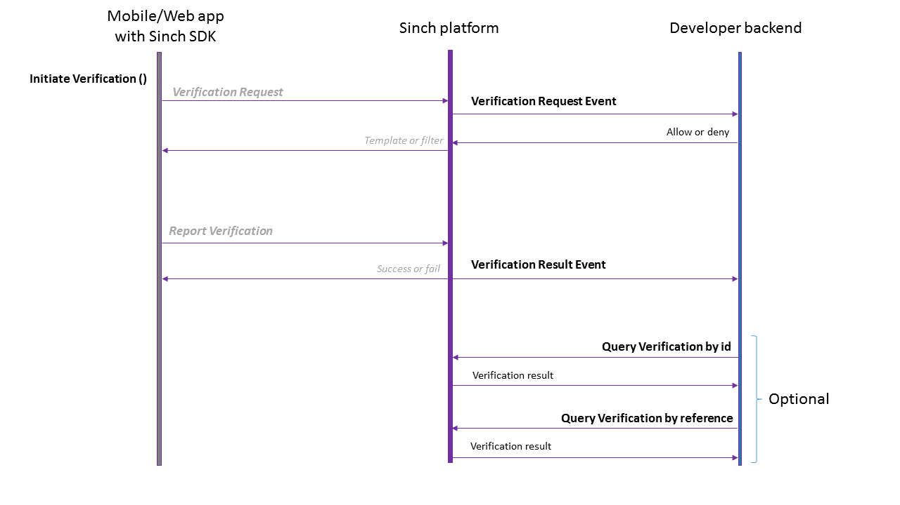
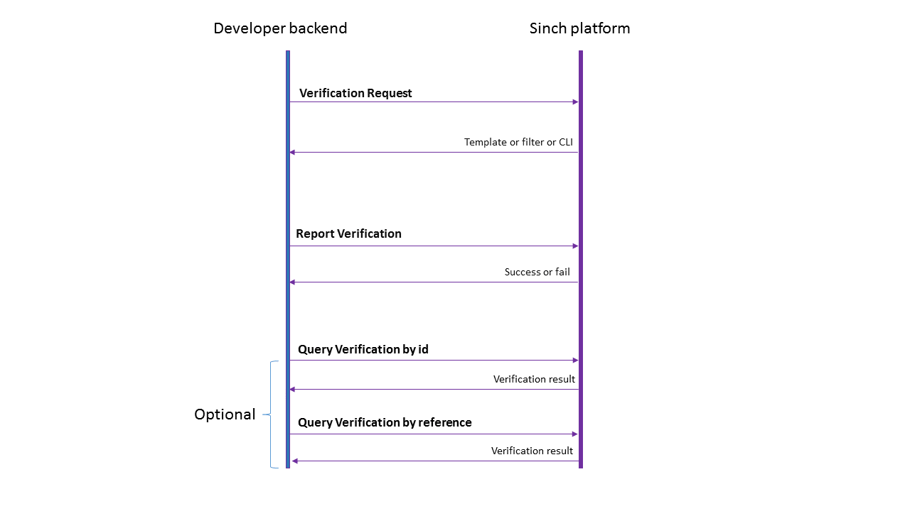

# Verification REST API for verifying phone numbers and users

Learn about the support of FlashCall verification, PIN SMS verification and Callout verification.

## TL;DR

Curl examples for verification API:

### SMS Request

```bash
curl --user APPLICATION_KEY:APPLICATION_SECRET https://verificationapi-v1.sinch.com/verification/v1/verifications -H "Content-Type: application/json" --data '{"identity":{"type":"number","endpoint":"+1555123123"},"method":"sms"}'
```

### SMS Report

```bash
curl -X PUT --user APPLICATION_KEY:APPLICATION_SECRET https://verificationapi-v1.sinch.com/verification/v1/verifications/number/+1555123123 -H "Content-Type: application/json" --data '{"method": "sms", "sms": {"code": "OTPCODE"}}'
```

### Flashcall Request

```bash
curl --user APPLICATION_KEY:APPLICATION_SECRET https://verificationapi-v1.sinch.com/verification/v1/verifications -H "Content-Type: application/json" --data '{"identity":{"type":"number","endpoint":"+1555123123"},"method":"flashcall"}'
```

### Flashcall Report

```bash
curl -X PUT --user APPLICATION_KEY:APPLICATION_SECRET https://verificationapi-v1.sinch.com/verification/v1/verifications/number/+1555123123 -H "Content-Type: application/json" --data '{"method": "flashcall", "flashcall": {"cli": "OTPCODE"}}'
```

**Note:** OTPCODE must be the full valid E.164 number that we called from.

## Overview

For general information on how to use the Sinch APIs including methods, types, errors and authorization, please visit the [Using REST](/docs/voice/authentication.md) page.

Use the Sinch Verification Service to verify end-user's mobile phone numbers. The Sinch Verification APIs should be used in combination with the Verification SDKs for a complete end-to-end solution, though it's possible to only use the APIs. Currently, there are three verification methods supported:

- FlashCall verification - Android only
- PIN SMS verification - iOS, Android, Javascript
- Callout verification (voice call) - iOS only

## FlashCall verification

With the flashCall verification method, a user's phone number is verified by triggering a "missed call" towards this number. The call is intercepted by the Android SDK in the mobile app and blocked automatically.

To initiate a flashCall verification, visit [Android SDK documentation](/docs/verification/android/android-the-verification-process.md). For additional security, it's recommended that you control which verification requests should proceed and which ones not, by listening in your backend for the [Verification Request Event](/docs/verification/rest-api/verification-api.md#verification-request) and respond accordingly. Your backend will be notified on the result of the verification with the [Verification Result Event](/docs/verification/rest-api/callback-api.md#verification-result-event).

## PIN SMS verification

With the PIN SMS verification method, a user's phone number is verified by sending an SMS containing a PIN code to this number. In the case of iOS or Javascript, the user needs to enter the PIN manually in the app, while for Android there is an option of intercepting the SMS message delivery and capturing the PIN code automatically.

To initiate a PIN SMS verification, check the [iOS](/docs/verification/ios.md) or [Android](/docs/verification/android.md) documentation. For additional security, it's recommended that you control which verification requests should proceed and which ones not, by listening in your backend for the [Verification Request Event](/docs/verification/rest-api/verification-api.md#verification-request) and respond accordingly. Your backend will be notified on the result of the verification with the [Verification Result Event](/docs/verification/rest-api/callback-api.md#verification-result-event).

## Callout verification

With the callout verification method, a user's phone number is verified by receiving a phone call and hearing a pre-recorded or text-to-speech message, advising the user to press a digit code. When the user presses the digit code in the dialpad, the verification is successful.

To initiate a callout verification, check the [iOS documentation](/docs/verification/ios.md). For additional security, it's recommended that you control which verification requests should proceed and which ones not, by listening in your backend for the [Verification Request Event](/docs/verification/rest-api/verification-api.md#verification-request) and respond accordingly. Your backend will be notified on the result of the verification with the [Verification Result Event](/docs/verification/rest-api/callback-api.md#verification-result-event).

## API Quick Reference

### Verification API

```text
URI:  https://verificationapi-v1.sinch.com/verification/v1
```

| URL                                  | HTTP Verb | Functionality                                                                                                      | Notes                                      |
| ------------------------------------ | --------- | ------------------------------------------------------------------------------------------------------------------ | ------------------------------------------ |
| /verifications                       | POST      | [Verification Request](/docs/verification/rest-api/verification-api.md#verification-request)                       | Not needed when using the Verification SDK |
| /verifications/{type}/{endpoint}     | PUT       | [Report Verification](/docs/verification/rest-api/verification-api.md#report-verification)                         | Not needed when using the Verification SDK |
| /verifications/id/{id}               | GET       | [Query Verification by ID](/docs/verification/rest-api/verification-api.md#query-by-id)                            | none                                       |
| /verifications/reference/{reference} | GET       | [Query Verification by reference](/docs/verification/rest-api/verification-api.md#query-verification-by-reference) | none                                       |
| /verifications/{type}/{endpoint}     | GET       | [Query Verification by Endpoint](/docs/verification/rest-api/verification-api.md#query-by-endpoint)                | none                                       |

### Verification Callback API

| Event                    | HTTP Verb | Functionality                                                                                      | Notes                                        |
| ------------------------ | --------- | -------------------------------------------------------------------------------------------------- | -------------------------------------------- |
| VerificationRequestEvent | POST      | [Verification Request Event](/docs/verification/rest-api/verification-api.md#verification-request) | Recommended for security purposes            |
| VerificationResultEvent  | POST      | [Verification Result Event](/docs/verification/rest-api/callback-api.md#verification-result-event) | Recommended for verification result tracking |

## How to use the Verification APIs

In combination with the Mobile or Web SDK (recommended)

The following diagram shows how to use the Verification APIs when using the iOS, Android or Javascript SDKs to initiate a verification.


:::info WARNING: Important

In this scenario, the _Verification Request_ and _Report Verification_ APIs don't need to be called explicitly by the app, since the SDK is handling that for you.

:::

If you have configured a verification callback URL in the Sinch Portal (recommended), with every verification that's initiated by the app, Sinch will send a [Verification Request Event](/docs/verification/rest-api/verification-api.md#verification-request) to your backend, to get permission to perform the verification. If your backend allows the verification request to proceed, Sinch will trigger a flashcall, SMS or call towards the phone to be verified. Once the phone receives the flash-call, SMS or voice call, the SDK will report back the CLI or PIN respectively so that the Sinch dashboard can compare its validity. The Sinch backend responds with the result of the verification to the client and sends a [Verification Result Event](/docs/verification/rest-api/callback-api.md#verification-result-event) to your backend. The status of a verification can also be queried ad-hoc by using the "Query Verification" APIs.

## Without the mobile or web SDK

If you are not using the mobile or web Verification SDKs, then you need to implement all the client logic for intercepting calls (in case of flashcalls) and reporting the CLI or PIN (in case of SMS or callout verification) inside your app. The following diagram shows how to use Sinch Verification in this scenario.


The verification requests will be triggered from your backend towards Sinch with the [Verification Request API](/docs/verification/rest-api/verification-api.md#verification-request), by doing an [application signed request](/docs/voice/authentication.md#application-signed-request). Sinch dashboard will respond with the CLI filter (for flashcalls) or the template (in case of an SMS), or the polling intervals (in case of a callout). As soon as the flashcall or SMS is received by your app, your backend will need to report back to Sinch the CLI or PIN that was reported through the [Report Verification API](/docs/verification/rest-api/verification-api.md#report-verification). Sinch will respond with the result of the verification.
