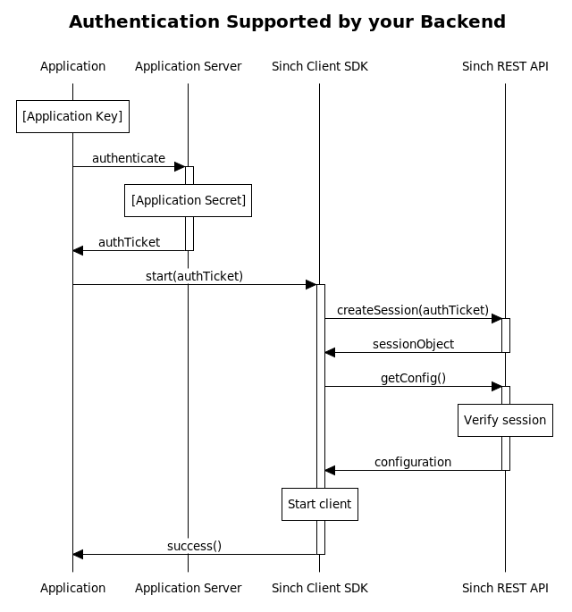
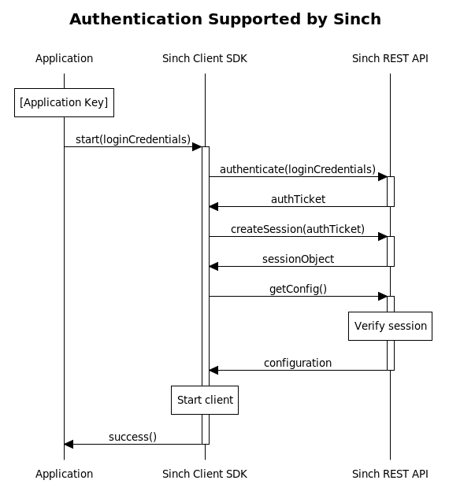

## Authentication by your backend

it's possible to integrate Sinch with your existing user management solution. With this method, you get full control of your user database and can authenticate users in whichever way you see best fit; it may even be a third party solution.

This solution requires you to generate an authentication ticket using your application key and application secret on your Application Server. See the [Reference Documentation](http://www.sinch.com/docs/javascript/reference/) for more information about generating this ticket.

The authentication ticket is then sent to Sinch, using the `.start()` method in the `SinchClient` instance. The ticket is exchanged into a Sinch session, and the rest of the process is identical to when Sinch manages your users.

> **Note**
>
> Included with the Sinch JS SDK are samples for getting you started with the integration of your authentication scheme with Sinch.


Authentication Supported by Partner
Backend

This method, where you authenticate users with your backend, may look like this:

```javascript
var sinchClient = new SinchClient({
  applicationKey: "MY_APPLICATION_KEY",
  capabilities: { messaging: true },
});

// This jQuery call is just an example how you might authenticate users and pass the ticket to Sinch.
$.post(
  "https://example.com/auth",
  { username: "alice", password: "somethingSecure" },
  function (authTicket) {
    sinchClient
      .start(authTicket)
      .then(function () {
        // Handle successful start, like showing the UI
      })
      .fail(function (error) {
        // Handle Sinch error
      });
  },
  function (error) {
    // Handle application server error
  }
);
```

This code will first instantiate the sinchClient with your application key. In this example, jQuery is used to perform an ajax request to your application server for authenticating the user _Alice_. jQuery will parse the json object and pass it to `sinchClient.start()`.

When `sinchClient.start()` has successfully started the client, the success callback is executed, which may display the UI, or enable some buttons, or other actions you now want to take.

## Authentication by Sinch

The Sinch JavaScript SDK allows for an easy authentication process requiring no backend, in order to get started quickly.

> **Warning**
>
> We don't recommend to use this authentication model, when launching your app live since you have no control over user creation. When going live, Sinch JS authentication can be disabled in the “App setting” section within the Dashboard.

Sinch JS authentication involves authenticating end-users by passing a user identity and password to `sinchClient.start()` when starting Sinch. In this scenario only the application key is needed; the application secret is not used and the authentication of individual users will be managed by us based on supplied user identity and password.

Authentication Supported by
Sinch

Authentication using this method is very straight forward, as you only have to make one method call. The Sinch SDK will take care of the rest under the hood. Implementing Sinch user authentication in your app may look something like this:

```javascript
var sinchClient = new SinchClient({
  applicationKey: "MY_APPLICATION_KEY",
  capabilities: { messaging: true },
});

sinchClient
  .start({ username: "alice", password: "somethingSecure" })
  .then(function () {
    // Perform actions to do when authenticated, such as displaying user interface
  });
```

This code will instantiate SinchClient, and will start the client using the username _‘Alice’_.
