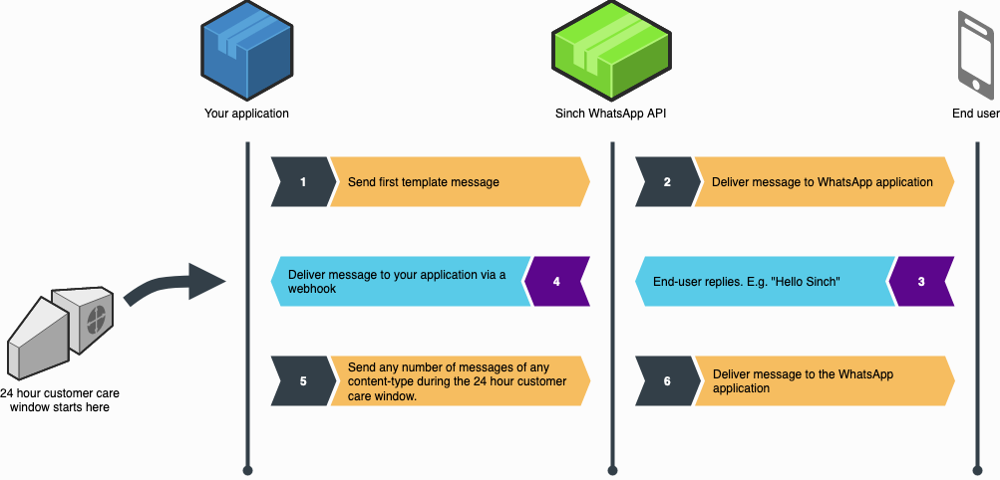

# Send WhatsApp Messages

Send messages via WhatsApp with Sinch WhatsApp API. Get more information here.

The message endpoint is used as the primary endpoint of the API and this is where all the messages are sent through.

## WhatsApp message flow



1. Customer opt-in is essential before sending any messages.
2. Businesses can only start a conversation with a defined message template.
3. Once you get a reply from your customer, a _customer care session_ starts. You can then send “session” rich content messages for 24 hours.
4. Every time a customer replies to one of your messages, a new 24-hour cycle starts.
5. If a “session” expires, you’ll need to re-initiate a conversation, starting with a defined message template again.
6. Customers can start a rich content conversation with a business at any time; this opens up a new 24-hour session.

## Send a WhatsApp message

### Request

`POST whatsapp/v1/{bot-id}/messages`

JSON object parameters:

| Name     | Description                                                          | JSON Type    | Default | Constraints          | Required |
| -------- | -------------------------------------------------------------------- | ------------ | ------- | -------------------- | :------: |
| to       | List of MSISDNs                                                      | String array | N/A     | 1 to 20 elements     |   Yes    |
| message  | Message object                                                       | Object       | N/A     | Valid Message object |   Yes    |
| callback | Callback URL to overwrite configured callback URL for status updates | String       | N/A     | Valid URL            |    No    |

### Response

`201 Created`

The response body is a JSON object with the same format as a [delivery report callback](/docs/whatsapp/http-rest/callback.md#delivery-report-callback).

```json
{
  "type": "whatsapp",
  "statuses": [
    {
      "message_id": "01DPNXZ0WCF9XD19MH84XD0P62",
      "recipient": "+46732001122",
      "status": "success",
      "state": "queued"
    }
  ]
}
```

`400 Bad Request`

There was an error with your request. The body is a JSON object described in the [introduction](/docs/whatsapp/introduction.md#http-errors).

`401 Unauthorized`

There was an authentication error with your request. Either you're using incorrect credentials or you're attempting to authenticate
in a region where your bot doesn't reside. The body is a JSON object described in the [introduction](/docs/whatsapp/introduction.md#http-errors).

## Message object types

The types of messages that can be sent are one of the following:

### Template message

Accepted language codes can be found in the [introduction](/docs/whatsapp/introduction.md#supported-language-codes). You can use [media provider](/docs/whatsapp/http-rest/media-provider.md) feature in template messages.

JSON object parameters:

| Name          | Description                                                                                                                                                                                                                                                                                                                              | JSON Type              | Default | Constraints                                                                                                                                    |                                                 Required                                                 |
| ------------- | ---------------------------------------------------------------------------------------------------------------------------------------------------------------------------------------------------------------------------------------------------------------------------------------------------------------------------------------- | ---------------------- | ------- | ---------------------------------------------------------------------------------------------------------------------------------------------- | :------------------------------------------------------------------------------------------------------: |
| type          | Constant value `template`.                                                                                                                                                                                                                                                                                                               | String                 | N/A     | N/A                                                                                                                                            |                                                   Yes                                                    |
| template_name | Name of the template.                                                                                                                                                                                                                                                                                                                    | String                 | N/A     | N/A                                                                                                                                            |                                                   Yes                                                    |
| language      | Language to send the template in.                                                                                                                                                                                                                                                                                                        | String                 | `en`    | Language codes and locales (e.g `en`, `en_us`)                                                                                                 |                                                    No                                                    |
| params        | Parameters to inject into the template. DEPRECATED, please use `body_params` and `header_params` instead.                                                                                                                                                                                                                                | String array           | N/A     | This parameter can only be used for template messages with only a body of text.                                                                |                                                    No                                                    |
| header_params | Parameter to inject into the header of the template.                                                                                                                                                                                                                                                                                     | String array           | N/A     | Can only used when there is a header of type text in the template. Up to 60 characters for all parameters and predefined template header text. |                                                    No                                                    |
| body_params   | Parameters to inject into the body of the template.                                                                                                                                                                                                                                                                                      | String array           | N/A     | Up to 1024 characters for all parameters and predefined template text.                                                                         |                                                    No                                                    |
| media         | An object describing the document, image or video to include in the header of the template. The objects are the same as described under Document message, Image message and Video message below, except that the `caption` parameter is not allowed. Also see the note below. For a message without media, set the media type to `text`. | String array           | N/A     | N/A                                                                                                                                            |                                                   Yes                                                    |
| buttons       | A list of buttons to include in the template message.                                                                                                                                                                                                                                                                                    | List of button objects | N/A     | N/A                                                                                                                                            | Yes, if the template definition includes either at least one quick reply button or a dynamic URL button. |
| ttl           | Time to live of the template message. If the receiver hasn't opened the template message before the time to live expires, the message will be deleted and a failed callback will be sent. The time to live can be specified in ISO-8601 Duration format or in seconds as a string.                                                       | String                 | 30 Days | See description                                                                                                                                |                                                    No                                                    |

:::info Note

The `caption` parameter is not supported for media in template messages. For document media, the `filename` parameter can be used to describe the file. If the `filename` parameter is not explicitly used, it will take the default value "Filename".

Audio template messages are not supported.

:::

```json
{
  "to": ["46732001122"],
  "message": {
    "type": "template",
    "template_name": "test_template",
    "language": "en",
    "body_params": ["param here"],
    "media": {
      "type": "text"
    }
  }
}
```

```json
{
  "to": ["46732001122"],
  "message": {
    "type": "template",
    "template_name": "demo_rich_text",
    "language": "en",
    "header_params": ["Nick"],
    "body_params": ["Swan Lake"],
    "media": {
      "type": "text"
    }
  }
}
```

### Templates with buttons

- Call button

| Name | Description         | JSON Type | Constraints | Required |
| ---- | ------------------- | --------- | ----------- | :------: |
| type | The type of button. | String    | `call`      |   Yes    |

- URL button

| Name      | Description                                         | JSON Type | Constraints |                  Required                   |
| --------- | --------------------------------------------------- | --------- | ----------- | :-----------------------------------------: |
| type      | The type of button.                                 | String    | `url`       |                     Yes                     |
| parameter | The URL parameter for the variable part of the URL. | String    | N/A         | Yes, if the button is a dynamic URL button. |

- Quick reply button

| Name    | Description                                                | JSON Type | Constraints   | Required |
| ------- | ---------------------------------------------------------- | --------- | ------------- | :------: |
| type    | The type of button.                                        | String    | `quick_reply` |   Yes    |
| payload | A payload to return when the recipient presses the button. | String    | N/A           |    No    |

[Find more button examples here](/docs/whatsapp/http-rest/examples.md).

```json
{
  "to": ["46732001122"],
  "message": {
    "type": "template",
    "template_name": "some_template_name",
    "language": "en",
    "header_params": ["a_parameter"],
    "body_params": ["some_first_parameter", "some_second_parameter"],
    "media": {
      "type": "image",
      "url": "https://www.example.com/some_image.jpg",
      "provider": "some_provider_name"
    },
    "buttons": [
      {
        "type": "call"
      },
      {
        "type": "url",
        "parameter": "some_url_parameter"
      }
    ],
    "ttl": "P1D"
  }
}
```

```json
{
  "to": ["46732001122"],
  "message": {
    "type": "template",
    "template_name": "some_template_name",
    "language": "en",
    "header_params": ["some_parameter"],
    "body_params": ["some_first_parameter", "some_second_parameter"],
    "media": {
      "type": "text"
    },
    "buttons": [
      {
        "type": "quick_reply",
        "payload": "some_quick_reply_payload"
      },
      {
        "type": "quick_reply"
      }
    ]
  }
}
```

### Text message

Available formatting and using emojis for the text message content can be found in the [introduction](/docs/whatsapp/introduction.md#formatting-text-messages).

JSON object parameters:

| Name        | Description              | JSON Type | Default | Constraints           | Required |
| ----------- | ------------------------ | --------- | ------- | --------------------- | :------: |
| type        | Constant value `text`    | String    | N/A     | N/A                   |   Yes    |
| preview_url | Message object           | Boolean   | false   | `true` or `false`     |    No    |
| text        | The text message content | String    | N/A     | Up to 4096 characters |   Yes    |

```json
{
  "to": ["46732001122"],
  "message": {
    "type": "text",
    "preview_url": false,
    "text": "Greetings from Sinch"
  }
}
```

### Image message

:::info Note

Any media file sent through the Sinch WhatsApp API can be at most 100.0 MB

:::

Accepted content types can be found in the [introduction](/docs/whatsapp/introduction.md#accepted-media-types).

JSON object parameters:

| Name     | Description                                                              | JSON Type | Default | Constraints                  | Required |
| -------- | ------------------------------------------------------------------------ | --------- | ------- | ---------------------------- | :------: |
| type     | Constant value `image`                                                   | String    | N/A     | N/A                          |   Yes    |
| url      | Public url of the image file. Should be either HTTP or HTTPS link.       | String    | N/A     | Accepted Content-Type header |   Yes    |
| caption  | Optional caption that will be displayed underneath the image.            | String    | None    | N/A                          |    No    |
| provider | Optional name of a provider to be used when trying to download the file. | String    | None    | N/A                          |    No    |

```json
{
  "to": ["46732001122"],
  "message": {
    "type": "image",
    "url": "https://example.com/image.jpg",
    "caption": "Example Image"
  }
}
```

### Video message

:::info Note

Any media file sent through the Sinch WhatsApp API can be at most 100.0 MB

:::

Accepted content types can be found in the [introduction](/docs/whatsapp/introduction.md#accepted-media-types).

JSON object parameters:

| Name     | Description                                                              | JSON Type | Default | Constraints                  | Required |
| -------- | ------------------------------------------------------------------------ | --------- | ------- | ---------------------------- | :------: |
| type     | Constant value `video`                                                   | String    | N/A     | N/A                          |   Yes    |
| url      | Public url of the video file (mp4). Should be either HTTP or HTTPS link. | String    | N/A     | Accepted Content-Type header |   Yes    |
| caption  | Optional caption that will be displayed underneath the video.            | String    | None    | N/A                          |    No    |
| provider | Optional name of a provider to be used when trying to download the file. | String    | None    | N/A                          |    No    |

```json
{
  "to": ["46732001122"],
  "message": {
    "type": "video",
    "url": "https://example.com/video.mp4",
    "caption": "Example Video",
    "provider": "your-bearer-provider"
  }
}
```

### Document message

:::info Note

Any media file sent through the Sinch WhatsApp API can be at most 100.0 MB

:::

Accepted content types can be found in the [introduction](/docs/whatsapp/introduction.md#accepted-media-types).

JSON object parameters:

| Name     | Description                                                              | JSON Type | Default | Constraints                  | Required |
| -------- | ------------------------------------------------------------------------ | --------- | ------- | ---------------------------- | :------: |
| type     | Constant value `document`                                                | String    | N/A     | N/A                          |   Yes    |
| url      | Public url of the document file. Should be either HTTP or HTTPS link.    | String    | N/A     | Accepted Content-Type header |   Yes    |
| filename | Optional parameter that describes the filename of the document.          | String    | None    | N/A                          |    No    |
| caption  | Optional caption that will be displayed as the document title.           | String    | None    | N/A                          |    No    |
| provider | Optional name of a provider to be used when trying to download the file. | String    | None    | N/A                          |    No    |

```json
{
  "to": ["46732001122"],
  "message": {
    "type": "document",
    "url": "https://example.com",
    "caption": "Example study",
    "filename": "document.pdf"
  }
}
```

### Audio message

:::info Note

Any media file sent through the Sinch WhatsApp API can be at most 100.0 MB

:::

Accepted content types can be found in the [introduction](/docs/whatsapp/introduction.md#accepted-media-types).

JSON object parameters:

| Name     | Description                                                              | JSON Type | Default | Constraints                  | Required |
| -------- | ------------------------------------------------------------------------ | --------- | ------- | ---------------------------- | :------: |
| type     | Constant value `audio`                                                   | String    | N/A     | N/A                          |   Yes    |
| url      | Public url of the audio file. Should be either HTTP or HTTPS link.       | String    | N/A     | Accepted Content-Type header |   Yes    |
| provider | Optional name of a provider to be used when trying to download the file. | String    | None    | N/A                          |    No    |

```json
{
  "to": ["46732001122"],
  "message": {
    "type": "audio",
    "url": "https://example.com/song.mp3"
  }
}
```

### Location message

JSON object parameters:

| Name    | Description                                                     | JSON Type | Default | Constraints  | Required |
| ------- | --------------------------------------------------------------- | --------- | ------- | ------------ | :------: |
| type    | Constant value `location`                                       | String    | N/A     | N/A          |   Yes    |
| lat     | The latitude position as a float number.                        | Number    | N/A     | \[-90, 90]   |   Yes    |
| lng     | The longitude position as a float number.                       | Number    | N/A     | \[-180, 180] |   Yes    |
| name    | The name for the location. Will be displayed in the message.    | String    | N/A     | N/A          |    No    |
| address | The address for the location. Will be displayed in the message. | String    | N/A     | N/A          |    No    |

```json
{
  "to": ["46732001122"],
  "message": {
    "type": "location",
    "lat": 55.7047,
    "lng": 13.191,
    "name": "Sinch Ideon Lund",
    "address": "Scheelevägen 17"
  }
}
```

### Contacts message

JSON object parameters:

| Name     | Description               | JSON Type    | Default | Constraints         | Required |
| -------- | ------------------------- | ------------ | ------- | ------------------- | :------: |
| type     | Constant value `contacts` | String       | N/A     | N/A                 |   Yes    |
| contacts | List of contact cards     | Object array | N/A     | Valid contact cards |   Yes    |

```json
{
  "to": ["46732001122"],
  "message": {
    "type": "contacts",
    "contacts": [
      {
        "addresses": [
          {
            "city": "Menlo Park",
            "country": "United States",
            "country_code": "us",
            "state": "CA",
            "street": "1 Hacker Way",
            "type": "HOME",
            "zip": "94025"
          }
        ],
        "birthday": "2012-08-18",
        "emails": [
          {
            "email": "test@fb.com",
            "type": "WORK"
          }
        ],
        "name": {
          "first_name": "John",
          "formatted_name": "John Smith",
          "last_name": "Smith"
        },
        "org": {
          "company": "WhatsApp",
          "department": "Design",
          "title": "Manager"
        },
        "phones": [
          {
            "phone": "+1 (650) 555-1234",
            "type": "WORK",
            "wa_id": "16505551234"
          }
        ],
        "urls": [
          {
            "url": "https://www.facebook.com",
            "type": "WORK"
          }
        ]
      }
    ]
  }
}
```

### Sticker message

Custom sticker must comply with WhatsApp requirements:

1. Each sticker should have a transparent background.
2. Stickers must be exactly 512x512 pixels.
3. Each sticker must be less than 100 KB.

Please note that WhatsApp doesn't support animated stickers.

:::info Note

For more information on using a custom sticker, please visit [WhatsApp sticker page](https://faq.whatsapp.com/en/general/26000345)

:::

Accepted content types can be found in the [introduction](/docs/whatsapp/introduction.md#accepted-media-types).

JSON object parameters:

| Name     | Description                                                                    | JSON Type | Default | Constraints                                                               | Required |
| -------- | ------------------------------------------------------------------------------ | --------- | ------- | ------------------------------------------------------------------------- | :------: |
| type     | Constant value `sticker`.                                                      | String    | N/A     | `sticker`                                                                 |   Yes    |
| url      | Public url of the sticker file. Should be either HTTP or HTTPS link.           | String    | N/A     | Accepted Content-Type header. Must not be used in combination with `id`.  |   Yes    |
| id       | ID of a sticker. Can be found using the stickerpack management endpoints.      | String    | N/A     | Accepted Content-Type header. Must not be used in combination with `url`. |   Yes    |
| provider | Optional name of a media provider to be used when trying to download the file. | String    | None    | Can only be used in combination with `url`, not with `id`.                |    No    |

:::info Note

Only one of the parameters `url` and `id` may be used in a single request.

:::

```json
{
  "to": ["46732001122"],
  "message": {
    "type": "sticker",
    "url": "https://example.com/sticker.webp"
  }
}
```

:::info Note

Stickers can be organized in stickerpacks. See [Stickerpack Management](/docs/whatsapp/http-rest/stickerpack-management.md) for more on this.

:::
