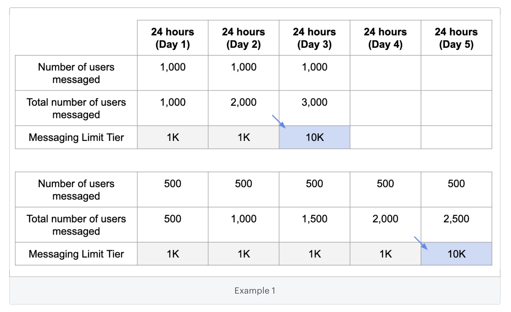
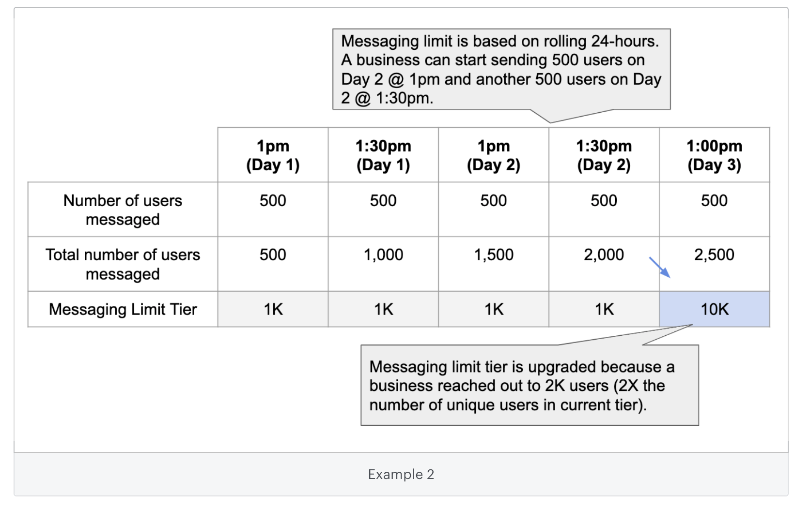

# Messaging Limits

Limits to how many users your business can send to per day

Messaging limits determine how many users your business can send messages to on a daily basis. This includes new conversations as well as existing conversations with users. The messaging limit doesn't limit the number of messages your business can send, just the number of users you are trying to message. It also doesn't apply to messages sent in response to a user-initiated message within a 24-hour period.

    - Tier 1: Allows your business to send messages to 1K unique customers in a rolling 24-hour period.
    - Tier 2: Allows your business to send messages to 10K unique customers in a rolling 24-hour period.
    - Tier 3: Allows your business to send messages to 100K unique customers in a rolling 24-hour period.

**Note: A business starts in Tier 1 when it registers its phone number.**

A business’ phone number will be upgraded to the next tier if:

    - Its quality rating is not low, and
    - The cumulative amount of users it sends notifications to adds up to twice its current messaging limit within a 7-day period. Once the business reaches this threshold, it will be moved to the next tier. The minimum amount of time that this upgrade can occur is after 48 hours, when the business is sending messages up to their current limit every day.

See the charts below for examples of how a business might move to the next tier:

Example 1: A business is upgraded from Tier 1 to Tier 2 when it messages a total of 2,000 users within a 7-day period.

Example 2: The chart explains the concept of messaging limit in a rolling 24-hour window.

If you exceed your messaging limit any further messages you send to new users (that you have not messaged previously, within a 24-hour period) will fail with an error message like the following:

> Message failed to send because there are restrictions on how many messages can be sent from this phone number. This may be because too many previous messages were blocked or flagged as spam.
